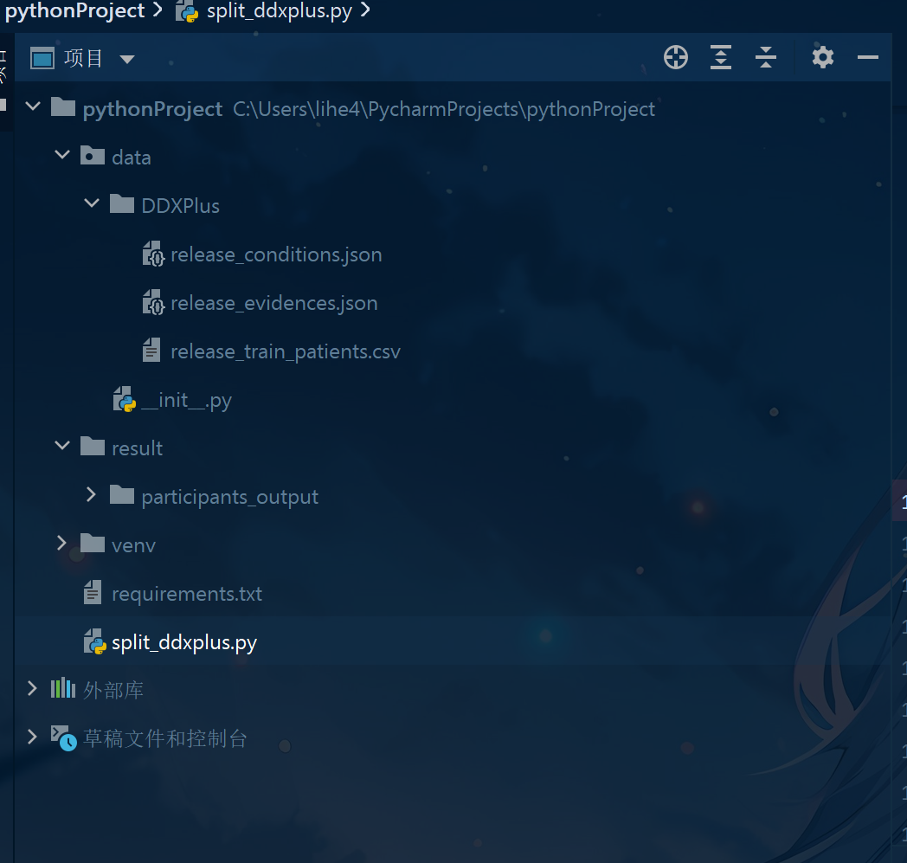
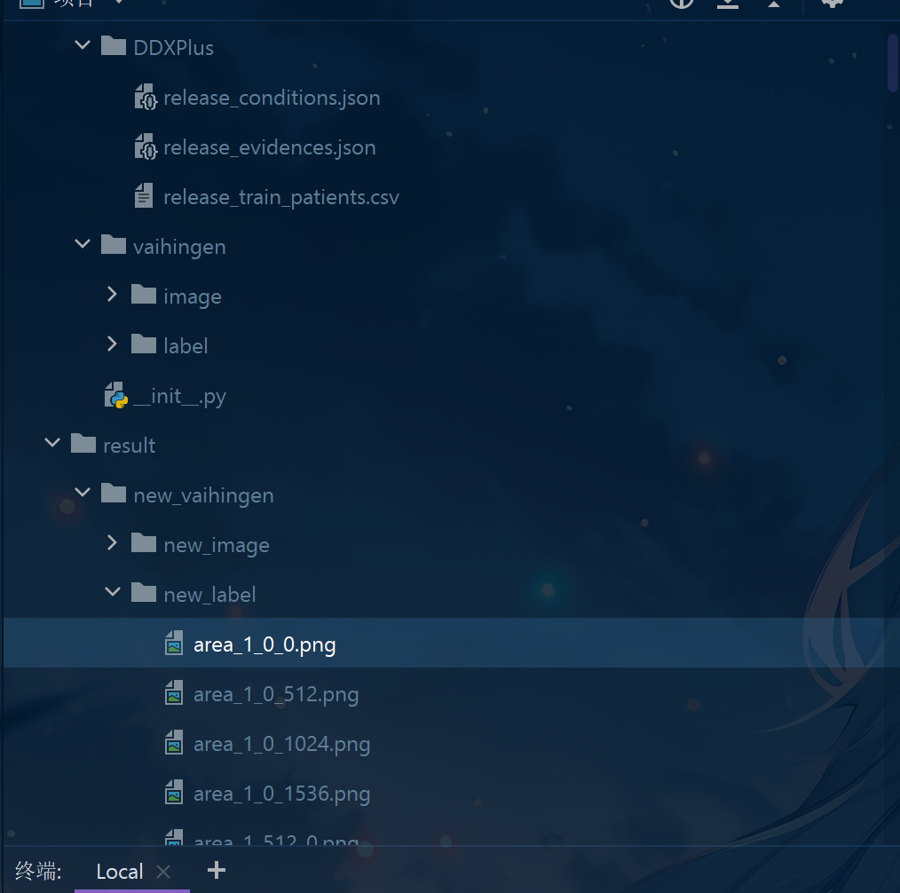

# 泰山第一次培训：python数据处理

# numpy

**NumPy（Numerical Python）**  是 Python 中用于**高效数值计算**的库，核心是提供一个强大的 `ndarray`​（多维数组）对象，类似于 C/C++ 中的数组，但支持更丰富的操作，比如切片、广播、线性代数等。

## 基本用法：

```
import numpy as np
```

#### 创建数组

```python
a = np.array([1, 2, 3])            # 一维数组
b = np.array([[1, 2], [3, 4]])     # 二维数组

print(a)  # [1 2 3]
print(b)  # [[1 2]
          #  [3 4]]
```

说明：使用 `np.array()`​ 可以把列表或嵌套列表转换为 NumPy 数组。

---

#### 查看数组形状和属性

```python
print(a.shape)   # (3,)   → 一维数组，3个元素
print(b.shape)   # (2, 2) → 2行2列

print(b.ndim)    # 2      → 二维数组
print(b.dtype)   # int64  → 元素类型
```

---

####  常用数组创建方法

```python
print(np.zeros((2, 3)))   # 全0数组
# [[0. 0. 0.]
#  [0. 0. 0.]]

print(np.ones((2, 2)))    # 全1数组
# [[1. 1.]
#  [1. 1.]]

print(np.eye(3))          # 单位矩阵
# [[1. 0. 0.]
#  [0. 1. 0.]
#  [0. 0. 1.]]

print(np.arange(0, 5, 1)) # 等差数组：[0 1 2 3 4]
print(np.linspace(0, 1, 5)) # 等间距：[0. 0.25 0.5 0.75 1.]
```

---

#### 数组运算

```python
a = np.array([1, 2, 3])
b = np.array([4, 5, 6])

print(a + b)    # [5 7 9]
print(a - b)    # [-3 -3 -3]
print(a * 2)    # [2 4 6]
print(a ** 2)   # [1 4 9]
```

说明：NumPy 支持逐元素运算，不需要写循环。

---

#### 数组统计函数

```python
a = np.array([1, 2, 3, 4])

print(np.sum(a))     # 总和：10
print(np.mean(a))    # 平均数：2.5
print(np.max(a))     # 最大值：4
print(np.min(a))     # 最小值：1
print(np.std(a))     # 标准差
```

---

####  数组索引和切片

```python
a = np.array([[10, 20, 30],
              [40, 50, 60]])

print(a[0, 1])    # 第1行第2列 → 20
print(a[1])       # 第2行 → [40 50 60]
print(a[:, 0])    # 第1列 → [10 40]
```

说明：二维数组使用 `a[行, 列]`​ 方式访问。

---

#### 形状变换

```python
a = np.arange(6)           # [0 1 2 3 4 5]
b = a.reshape((2, 3))      # 改成2行3列

print(b)
# [[0 1 2]
#  [3 4 5]]
```

---

#### 广播机制（自动对齐维度）

```python
a = np.array([[1, 2], [3, 4]])
b = np.array([10, 20])

print(a + b)
# [[11 22]
#  [13 24]]
```

说明：`b`​ 自动扩展为二维数组 `[10, 20]`​，重复到每一行。

---

#### 矩阵乘法 vs 元素乘法

```python
a = np.array([[1, 2],
              [3, 4]])
b = np.array([[5, 6],
              [7, 8]])

print(a * b)        # 元素乘法
# [[ 5 12]
#  [21 32]]

print(np.dot(a, b)) # 矩阵乘法
# [[19 22]
#  [43 50]]
```

---

#### 数组条件筛选

```python
a = np.array([1, 2, 3, 4, 5])
print(a[a > 3])     # [4 5]
```

---

#### 复制与原地修改

```python
a = np.array([1, 2, 3])
b = a.copy()       # 深拷贝，不影响原数组
b[0] = 99

print(a)           # [1 2 3]
print(b)           # [99 2 3]
```

‍

---

# pandas

**Pandas（Python Data Analysis Library）**  是 Python 中用于 **数据分析与处理** 的核心库，提供了强大的 `DataFrame`​ 和 `Series`​ 两种数据结构，适用于结构化数据（表格、Excel、数据库）的读取、清洗、分析、可视化等。

## 基本用法：

```
import pandas as pd
```

#### 创建 Series（一维数据）

```python
s = pd.Series([10, 20, 30, 40])
print(s)
# 0    10
# 1    20
# 2    30
# 3    40
# dtype: int64
```

说明：`Series`​ 是带标签的一维数组，默认索引为 0 开始的整数。

---

#### 创建 DataFrame（二维表格）

```python
data = {'name': ['Alice', 'Bob', 'Charlie'],
        'age': [25, 30, 35],
        'city': ['NY', 'LA', 'Chicago']}

df = pd.DataFrame(data)
print(df)
#      name  age     city
# 0   Alice   25       NY
# 1     Bob   30       LA
# 2  Charlie   35  Chicago
```

说明：`DataFrame`​ 是 Pandas 的核心表格型结构，类似于 Excel 表。

---

#### 查看数据基本信息

```python
print(df.shape)      # (3, 3) → 3行3列
print(df.columns)    # 列名：Index(['name', 'age', 'city'], dtype='object')
print(df.index)      # 行索引：RangeIndex(start=0, stop=3, step=1)
print(df.dtypes)     # 每列的数据类型
```

---

#### 读取常见文件

```python
# 读取 CSV 文件
df = pd.read_csv('data.csv')

# 读取 Excel 文件
df = pd.read_excel('data.xlsx')

# 保存为 CSV 文件
df.to_csv('output.csv', index=False)
```

---

#### 访问列与行

```python
print(df['name'])       # 访问单列（Series）
print(df[['name', 'age']])  # 多列（DataFrame）

print(df.loc[0])        # 按标签访问第1行
print(df.iloc[1])       # 按位置访问第2行
```

说明：`loc`​ 用标签，`iloc`​ 用索引位置。

---

#### 条件筛选

```python
print(df[df['age'] > 28])
# 筛选出 age > 28 的行
```

---

#### 添加、修改与删除列

```python
df['salary'] = [5000, 6000, 7000]  # 添加新列

print(df['age'] * 2)               # 修改方式：表达式

df.drop('city', axis=1, inplace=True)  # 删除列
```

---

#### 缺失值处理

```python
df = pd.DataFrame({
    'name': ['Alice', 'Bob', None],
    'age': [25, None, 35]
})

print(df.isnull())          # 判断是否为空
print(df.dropna())          # 删除含缺失值的行
print(df.fillna(0))         # 填充缺失值
```

---

#### 分组与聚合

```python
df = pd.DataFrame({
    'dept': ['IT', 'HR', 'IT', 'HR'],
    'salary': [6000, 5000, 7000, 5500]
})

print(df.groupby('dept').mean())
# 按部门求平均工资
```

---

#### 排序与唯一值

```python
print(df.sort_values('salary', ascending=False))  # 按工资降序
print(df['dept'].unique())    # 唯一值
```

---

#### 合并与拼接

```python
df1 = pd.DataFrame({'id': [1, 2], 'name': ['Alice', 'Bob']})
df2 = pd.DataFrame({'id': [1, 2], 'score': [90, 85]})

print(pd.merge(df1, df2, on='id'))  # 按 id 合并
```

---

#### 应用函数与映射

```python
df['age_group'] = df['age'].apply(lambda x: 'adult' if x >= 30 else 'young')
print(df)
```

说明：使用 `apply()`​ 可以对每个元素应用函数。

---

#### 导出结果

```python
df.to_csv('result.csv', index=False)
df.to_excel('result.xlsx', index=False)
```

---

# json

**json（JavaScript Object Notation）**  是一种轻量级的数据交换格式，Python 内置了 `json`​ 模块来方便地进行 **JSON 数据的解析和生成**，常用于**数据持久化**、**前后端通信**等场景。

## 基本用法：

```
import json
```

#### Python 与 JSON 的对应关系：

|Python 类型|JSON 类型|
| -------------| --------------|
|​`dict`​|object|
|​`list`​、`tuple`​|array|
|​`str`​|string|
|​`int`​/`float`​|number|
|​`True`​/`False`​|true / false|
|​`None`​|null|

---

#### Python 转 JSON 字符串（序列化）

```python
data = {"name": "Alice", "age": 25, "is_student": False}
json_str = json.dumps(data)

print(json_str)
# {"name": "Alice", "age": 25, "is_student": false}
```

说明：`json.dumps()`​ 可以把 Python 对象转换为 JSON 字符串。

---

#### JSON 字符串转 Python 对象（反序列化）

```python
json_str = '{"name": "Alice", "age": 25, "is_student": false}'
data = json.loads(json_str)

print(data)
# {'name': 'Alice', 'age': 25, 'is_student': False}
```

说明：`json.loads()`​ 可以把 JSON 字符串解析为 Python 对象。

---

#### 序列化时格式化输出

```python
data = {"name": "Bob", "scores": [90, 85, 88]}
print(json.dumps(data, indent=2))
# {
#   "name": "Bob",
#   "scores": [
#     90,
#     85,
#     88
#   ]
# }
```

说明：通过 `indent`​ 参数可控制缩进，增加可读性。

---

#### 中文处理

```python
data = {"name": "小明", "age": 18}
print(json.dumps(data, ensure_ascii=False))
# {"name": "小明", "age": 18}
```

说明：默认中文会转成 Unicode，用 `ensure_ascii=False`​ 可以保留中文。

---

#### 写入 JSON 文件

```python
data = {"title": "Python", "level": "beginner"}

with open("data.json", "w", encoding="utf-8") as f:
    json.dump(data, f, ensure_ascii=False, indent=2)


使用 with open(...) 打开一个文件：

"data.json"：要写入的文件名（如果没有会自动创建）

"w"：写入模式（write），会覆盖原有内容

encoding="utf-8"：指定编码为 UTF-8，确保中文不会乱码

f 是文件对象，代表这个打开的文件


```

说明：`json.dump()`​ 将 Python 对象写入文件，支持格式化输出。

---

#### 从 JSON 文件读取

```python
with open("data.json", "r", encoding="utf-8") as f:
    data = json.load(f)

print(data)
```

说明：`json.load()`​ 用于从文件中读取并解析 JSON 数据。

---

#### 复杂嵌套结构解析

```python
json_str = '''
{
  "user": {
    "name": "Tom",
    "skills": ["Python", "C++"]
  }
}
'''

data = json.loads(json_str)
print(data["user"]["skills"][0])  # Python
```

说明：嵌套结构可通过多级键访问。

---

#### 转换时处理非默认类型

```python
import datetime

def custom(obj):
    if isinstance(obj, datetime.datetime):
        return obj.isoformat()

now = datetime.datetime.now()
print(json.dumps({"time": now}, default=custom))
# {"time": "2025-07-28T11:30:00.123456"}
```

说明：使用 `default`​ 参数可以处理自定义类型。

---

#### 字符串与字典互转小技巧

```python
s = '{"x": 1, "y": 2}'
d = json.loads(s)
s2 = json.dumps(d)

print(type(d))   # <class 'dict'>
print(type(s2))  # <class 'str'>
```

---

#### 防止类型错误

```python
# 错误示例：集合不是 JSON 可序列化类型
data = {"nums": {1, 2, 3}}
# json.dumps(data) 会报错

# 解决方式：转换为 list
data["nums"] = list(data["nums"])
print(json.dumps(data))
```

说明：`json`​ 只支持部分 Python 类型，需提前转换。

---

#### 与字典深拷贝的配合

```python
import copy
original = {"a": 1, "b": [1, 2]}

# 用 json 序列化方式做深拷贝
clone = json.loads(json.dumps(original))

clone["b"][0] = 999
print(original)  # {'a': 1, 'b': [1, 2]}
print(clone)     # {'a': 1, 'b': [999, 2]}
```

说明：`json`​ 也可以作为一种简易深拷贝手段（前提是可序列化）。

---

# PIL / Pillow

**Pillow（PIL 的分支）**  是 Python 中用于**图像处理**的强大库，支持打开、编辑、保存多种格式的图片。Pillow 是原始 PIL 库的增强版，常用于图像缩放、裁剪、转换、绘图等操作。

## 基本用法：

```
from PIL import Image
```

---

#### 打开和显示图片

```python
img = Image.open("example.jpg")  # 打开图片
img.show()                       # 使用默认图片查看器显示
```

说明：使用 `Image.open()`​ 加载本地图片，`show()`​ 会调用系统图片查看器。

---

#### 查看图片属性

```python
print(img.format)    # 图片格式，如 JPEG
print(img.size)      # 尺寸：如 (宽, 高)
print(img.mode)      # 模式：如 RGB、L、RGBA
```

---

#### 保存图片

```python
img.save("output.png")   # 另存为 PNG 格式
```

说明：可以将图片保存为不同格式，只需更改文件后缀。

---

#### 图像转换

```python
gray = img.convert("L")   # 转为灰度图
rgba = img.convert("RGBA") # 转为含透明通道
```

说明：使用 `convert()`​ 可以转换图片颜色模式。

---

#### 图像缩放和缩略图

```python
resized = img.resize((100, 100))   # 强制缩放为100x100

thumb = img.copy()
thumb.thumbnail((100, 100))        # 缩略图，保持比例
```

说明：`resize()`​ 会强行变形，`thumbnail()`​ 则保持原比例缩小。

---

#### 裁剪图像

```python
box = (50, 50, 200, 200)      # 左、上、右、下坐标
cropped = img.crop(box)
cropped.show()
```

说明：裁剪区域的坐标单位为像素，左上角为原点 (0, 0)。

---

#### 旋转和翻转

```python
rotated = img.rotate(90)          # 顺时针旋转90°
flipped = img.transpose(Image.FLIP_LEFT_RIGHT)  # 水平翻转
```

说明：`rotate()`​ 默认逆时针，实际显示是顺时针；`transpose()`​ 支持翻转和旋转。

---

#### 叠加文字（绘图）

```python
from PIL import ImageDraw, ImageFont

draw = ImageDraw.Draw(img)
draw.text((10, 10), "Hello", fill="red")
img.show()
```

说明：使用 `ImageDraw.Draw()`​ 可对图像进行绘制，默认字体简单，若需设置字体需加载 `ImageFont`​。

---

#### 拼接图片

```python
img1 = Image.open("a.jpg")
img2 = Image.open("b.jpg")

new_img = Image.new("RGB", (img1.width + img2.width, img1.height))
new_img.paste(img1, (0, 0))
new_img.paste(img2, (img1.width, 0))
new_img.show()
```

说明：通过创建新图像并粘贴已有图像，可以实现拼接。

---

#### 获取像素值和修改像素

```python
pixel = img.getpixel((0, 0))    # 获取坐标(0,0)处像素
img.putpixel((0, 0), (255, 0, 0)) # 修改为红色像素（RGB 模式）
```

说明：适用于手动像素级操作，效率较低。

---

#### 图片转 numpy 数组

```python
import numpy as np

arr = np.array(img)
print(arr.shape)  # 如：(高, 宽, 通道数)
```

说明：配合 NumPy 可以进行高效的图像计算与分析。

---

#### numpy 数组转图片

```python
new_img = Image.fromarray(arr)
new_img.show()
```

说明：`Image.fromarray()`​ 可以把 NumPy 数组还原为图像对象。

---

#### 图像格式转换与压缩

```python
img.save("output.jpg", quality=85)  # 保存为 JPEG 并设置压缩质量
```

说明：`quality`​ 参数可控制 JPEG 图像压缩程度，范围 1\~95（默认是 75）。

---

#### 检查图片是否损坏

```python
try:
    img.verify()
    print("图片无损坏")
except:
    print("图片损坏")
```

说明：`verify()`​ 方法可以验证图片文件是否完整有效。

---

#### 创建纯色图像

```python
new_img = Image.new("RGB", (200, 200), color="blue")
new_img.show()
```

说明：`Image.new()`​ 可创建指定颜色和尺寸的新图片。

---

# opencv

**OpenCV（Open Source Computer Vision Library）**  是一个开源的计算机视觉库，广泛用于图像处理、视频分析、人脸识别等任务。Python 中使用时通过 `cv2`​ 模块操作，支持 NumPy 数组与图像的高效互操作。

## 基本用法：

```
import cv2
```

---

#### 读取和显示图片

```python
img = cv2.imread("a.jpg")       # 读取图像
cv2.imshow("Image", img)        # 显示图像窗口
cv2.waitKey(0)                  # 等待按键
cv2.destroyAllWindows()         # 关闭窗口
```

说明：OpenCV 使用 `BGR`​ 而非 `RGB`​；必须调用 `waitKey()`​ 才能显示窗口。

---

#### 保存图片

```python
cv2.imwrite("output.jpg", img)
```

说明：将图像保存为文件，支持 jpg/png 等格式。

---

#### 图像尺寸和属性

```python
print(img.shape)     # (高, 宽, 通道数)，例如 (400, 600, 3)
print(img.dtype)     # 图像数据类型，例如 uint8
```

---

#### 修改图像尺寸

```python
resized = cv2.resize(img, (200, 100))  # 宽200，高100
```

---

#### 转换颜色空间

```python
gray = cv2.cvtColor(img, cv2.COLOR_BGR2GRAY)   # 转灰度图
rgb = cv2.cvtColor(img, cv2.COLOR_BGR2RGB)     # BGR转RGB
```

---

#### 图像裁剪与ROI

```python
roi = img[100:200, 150:300]   # 裁剪区域：高100-200，宽150-300
```

说明：和 NumPy 一样用切片操作，裁剪结果仍是图像。

---

#### 图像绘图（在图上画图形）

```python
cv2.rectangle(img, (50, 50), (150, 150), (0, 255, 0), 2)  # 绿色矩形
cv2.circle(img, (100, 100), 30, (255, 0, 0), -1)          # 蓝色实心圆
cv2.line(img, (0, 0), (200, 200), (0, 0, 255), 3)         # 红色直线
```

---

#### 添加文字

```python
cv2.putText(img, "Hello", (50, 50), cv2.FONT_HERSHEY_SIMPLEX,
            1, (255, 255, 255), 2)
```

说明：可以自定义字体、大小、颜色和粗细。

---

#### 图像滤波（模糊）

```python
blur = cv2.GaussianBlur(img, (5, 5), 0)    # 高斯模糊
median = cv2.medianBlur(img, 5)           # 中值模糊
```

---

#### 边缘检测

```python
edges = cv2.Canny(img, 100, 200)   # 边缘检测
```

说明：两个参数为低/高阈值。

---

#### 图像阈值处理（二值化）

```python
gray = cv2.cvtColor(img, cv2.COLOR_BGR2GRAY)
_, thresh = cv2.threshold(gray, 127, 255, cv2.THRESH_BINARY)
```

---

#### 图像按位操作（遮罩）

```python
mask = np.zeros(img.shape[:2], dtype=np.uint8)
mask[100:200, 100:200] = 255
masked = cv2.bitwise_and(img, img, mask=mask)
```

---

#### 摄像头读取（实时视频）

```python
cap = cv2.VideoCapture(0)  # 0代表默认摄像头

while True:
    ret, frame = cap.read()
    if not ret:
        break
    cv2.imshow("Live", frame)
    if cv2.waitKey(1) == ord("q"):
        break

cap.release()
cv2.destroyAllWindows()
```

说明：按下 `q`​ 键退出循环。

---

#### 图像通道操作

```python
b, g, r = cv2.split(img)         # 拆分BGR通道
merged = cv2.merge([b, g, r])    # 合并通道
```

---

#### 图像叠加（加权合并）

```python
blended = cv2.addWeighted(img1, 0.6, img2, 0.4, 0)
```

说明：将两张图按比例混合，适用于图像融合、水印等。

---

#### 轮廓检测（基本）

```python
gray = cv2.cvtColor(img, cv2.COLOR_BGR2GRAY)
_, thresh = cv2.threshold(gray, 127, 255, cv2.THRESH_BINARY)
contours, _ = cv2.findContours(thresh, cv2.RETR_EXTERNAL, cv2.CHAIN_APPROX_SIMPLE)
cv2.drawContours(img, contours, -1, (0, 255, 0), 2)
```

---

#### 保存视频

```python
fourcc = cv2.VideoWriter_fourcc(*'XVID')
out = cv2.VideoWriter('out.avi', fourcc, 20.0, (640, 480))

while True:
    ret, frame = cap.read()
    if not ret:
        break
    out.write(frame)
    cv2.imshow('Recording', frame)
    if cv2.waitKey(1) == ord('q'):
        break

cap.release()
out.release()
cv2.destroyAllWindows()
```

---

#### 复制与原地修改

```python
img_copy = img.copy()
img_copy[0:100, 0:100] = 0   # 修改左上角为黑色，不影响原图
```

---

### 任务一实践

任务：

通过编写脚本，处理DDXPlus数据集，将数据集release\_train\_patients中每个病人（案例）划分为一个json文件

（1）release\_train\_patients

（2）release\_evidences.json(里面含有代码(E\_91等)的映射关系)

（3）release\_conditions.json（里面有每个疾病的具体信息）

划分的json文件，要包含上述三个文件中的相应信息。

json文件命名格式participant\_{i}.json

因为train数据集的病人比较多，划分出200个病人的即可

```
├── data/
│   └── DDXPlus/
│       ├── release_evidences.json
│       ├── release_conditions.json
│       └── release_train_patients.csv
├── result/    ← 希望输出的 json 文件保存到这里result/participants_output
├── split_ddxplus.py  ← 要运行的脚本

```

```
创建虚拟环境
python -m venv venv

激活虚拟环境
.\.venv\Scripts\Activate.ps1

安装pandas库
pip install pandas
```



### split_ddxplus.py脚本源码学习

```python

   
import json             # 导入json模块，用于JSON数据的读取和写入
import os               # 导入os模块，用于文件和目录操作
import pandas as pd     # 导入pandas模块，用于读取和处理CSV文件


# 设置基础路径，即数据文件所在目录
base_path = 'data/DDXPlus'

# 构造训练数据CSV文件的完整路径
train_file = os.path.join(base_path, 'release_train_patients.csv')

# 构造证据JSON文件的完整路径
evidence_file = os.path.join(base_path, 'release_evidences.json')

# 构造病症条件JSON文件的完整路径
condition_file = os.path.join(base_path, 'release_conditions.json')


# 设置结果输出目录
output_dir = 'result/participants_output'

# 创建输出目录，如果目录已存在则不会报错
os.makedirs(output_dir, exist_ok=True)


# 读取训练数据CSV文件，结果是pandas的DataFrame对象
train_df = pd.read_csv(train_file)


# 以utf-8编码打开证据JSON文件，读取内容为Python对象（一般是list或dict）
with open(evidence_file, 'r', encoding='utf-8') as f:
    evidence_data = json.load(f)


# 判断evidence_data的类型，确保它是一个字典（方便后续按ID查找）
if isinstance(evidence_data, list):
    # 如果是列表，转换为字典，键为每个证据的'id'，值为该证据的完整信息
    evidence_map = {item['id']: item for item in evidence_data}
elif isinstance(evidence_data, dict):
    # 如果本来就是字典，直接赋值
    evidence_map = evidence_data
else:
    # 如果既不是list也不是dict，抛出异常提示格式不支持
    raise ValueError("release_evidences.json 格式不支持")


# 以utf-8编码打开条件JSON文件，读取内容为Python对象
with open(condition_file, 'r', encoding='utf-8') as f:
    condition_data = json.load(f)


# 同样判断condition_data类型，确保是字典格式
if isinstance(condition_data, list):
    # 如果是列表，转换为字典，键为病症id，值为病症详细信息
    condition_map = {item['id']: item for item in condition_data}
elif isinstance(condition_data, dict):
    # 直接赋值
    condition_map = condition_data
else:
    # 抛异常
    raise ValueError("release_conditions.json 格式不支持")


# 遍历训练数据的前200个病人记录（防止数据过多，控制处理数量）
for i in range(min(200, len(train_df))):
    # 通过iloc根据索引i选取DataFrame中的一行数据，返回Series对象
    row = train_df.iloc[i]


    # 解析该行中'evidence'字段的JSON字符串，转换成Python对象
    try:
        # 先判断'evidence'字段是否存在且不是空值，再用json.loads转换
        if 'evidence' in row and pd.notna(row['evidence']):
            patient_evidences_raw = json.loads(row['evidence'])
        else:
            patient_evidences_raw = []
    except:
        # 如果解析失败，则赋空列表，避免程序崩溃
        patient_evidences_raw = []


    # 同理解析'conditions'字段
    try:
        if 'conditions' in row and pd.notna(row['conditions']):
            patient_conditions_raw = json.loads(row['conditions'])
        else:
            patient_conditions_raw = []
    except:
        patient_conditions_raw = []


    # 从解析后的evidences列表中提取每条证据的id，过滤掉格式不对的数据
    evidence_ids = [e['id'] for e in patient_evidences_raw if isinstance(e, dict) and 'id' in e]

    # 确保patient_conditions_raw是列表类型，赋给condition_ids，否则赋空列表
    condition_ids = patient_conditions_raw if isinstance(patient_conditions_raw, list) else []


    # 根据id从证据字典中获取对应证据详细信息，忽略id不存在的情况
    evidence_details = [evidence_map[eid] for eid in evidence_ids if eid in evidence_map]

    # 根据id从条件字典中获取对应条件详细信息，忽略id不存在的情况
    condition_details = [condition_map[cid] for cid in condition_ids if cid in condition_map]


    # 将当前病人整行信息转换为字典形式，方便一起存储
    patient_info = row.to_dict()


    # 构造完整的病人数据结构，包括基本信息，证据详情，条件详情
    result = {
        'patient_info': patient_info,
        'evidence_details': evidence_details,
        'condition_details': condition_details
    }


    # 生成输出文件名，例如 participant_0.json
    filename = f'participant_{i}.json'

    # 拼接文件保存完整路径
    filepath = os.path.join(output_dir, filename)

    # 以写入模式打开文件，编码为utf-8
    with open(filepath, 'w', encoding='utf-8') as f:
        # 将result字典转换成格式化的JSON字符串写入文件，确保中文正常显示
        json.dump(result, f, ensure_ascii=False, indent=2)


    # 打印提示，表示当前病人数据已成功保存
    print(f"已保存：{filename}")
‍

```

‍

#### 详细分步解析

```python
import json
import os
import pandas as pd
```

- 导入 Python 标准库中的 `json`​ 用于 JSON 格式数据处理，`os`​ 用于操作文件路径和目录，`pandas`​ 用于处理 CSV 文件和表格数据。

```python
# 设置路径
base_path = 'data/DDXPlus'
train_file = os.path.join(base_path, 'release_train_patients.csv')
evidence_file = os.path.join(base_path, 'release_evidences.json')
condition_file = os.path.join(base_path, 'release_conditions.json')
```

- ​`base_path`​ 是数据集文件所在的根目录。
- 使用 `os.path.join`​ 拼接得到训练数据 CSV 文件的完整路径 `train_file`​。
- 同理，拼接得到 `evidence_file`​ 和 `condition_file`​ 的路径，分别对应证据和病症的 JSON 文件。

```python
# 输出目录
output_dir = 'result/participants_output'
os.makedirs(output_dir, exist_ok=True)
```

- 定义输出结果保存目录 `output_dir`​。
- ​`os.makedirs`​ 递归创建该目录，如果目录已存在则不会报错（`exist_ok=True`​）。

```python
# 读取 CSV 数据
train_df = pd.read_csv(train_file)
```

- 用 `pandas.read_csv`​ 读取训练数据 CSV 文件，存成一个 DataFrame 对象 `train_df`​，方便后续按行操作。

```python
# 读取 evidence JSON 数据
with open(evidence_file, 'r', encoding='utf-8') as f:
    evidence_data = json.load(f)
```

- 以 UTF-8 编码打开证据 JSON 文件，使用 `json.load`​ 读取成 Python 对象，赋值给 `evidence_data`​。

```python
# 判断 evidence_data 是不是 dict，不是就转换为 dict
if isinstance(evidence_data, list):
    evidence_map = {item['id']: item for item in evidence_data}
elif isinstance(evidence_data, dict):
    evidence_map = evidence_data
else:
    raise ValueError("release_evidences.json 格式不支持")
```

- 判断 `evidence_data`​ 的数据类型：

  - 如果是列表，则把每个证据的 `id`​ 作为 key，证据对象作为 value，构建成字典 `evidence_map`​ 方便快速查找。
  - 如果本身是字典，直接赋值给 `evidence_map`​。
  - 其它类型则抛出异常，提示格式不支持。

```python
# 读取 condition JSON 数据
with open(condition_file, 'r', encoding='utf-8') as f:
    condition_data = json.load(f)
```

- 以 UTF-8 编码打开疾病条件 JSON 文件，读取为 Python 对象 `condition_data`​。

```python
# 同样处理 condition_data
if isinstance(condition_data, list):
    condition_map = {item['id']: item for item in condition_data}
elif isinstance(condition_data, dict):
    condition_map = condition_data
else:
    raise ValueError("release_conditions.json 格式不支持")
```

- 对 `condition_data`​ 做同样的判断和转换，确保最终 `condition_map`​ 是字典，方便后续根据 ID 查找详细信息。

```python
# 处理前200个病人
for i in range(min(200, len(train_df))):
    row = train_df.iloc[i]
```

- 循环遍历训练数据的前 200 条记录（如果不足200条，就遍历所有）。
- ​`train_df.iloc[i]`​ 按索引 i 获取对应行数据，存到 `row`​，类型是 pandas Series。

```python
    try:
        patient_evidences_raw = json.loads(row['evidence']) if 'evidence' in row and pd.notna(row['evidence']) else []
    except:
        patient_evidences_raw = []
```

- 尝试解析当前行的 `'evidence'`​ 字段（应该是 JSON 字符串）：

  - 如果字段存在且不是空值，使用 `json.loads`​ 转成 Python 对象。
  - 如果不存在或是空，赋空列表。
  - 若解析失败（格式错误等），也赋空列表，避免程序崩溃。

```python
    try:
        patient_conditions_raw = json.loads(row['conditions']) if 'conditions' in row and pd.notna(row['conditions']) else []
    except:
        patient_conditions_raw = []
```

- 同理，尝试解析当前行的 `'conditions'`​ 字段，处理方法和上一段相同，得到原始条件列表 `patient_conditions_raw`​。

```python
    # 提取 ID
    evidence_ids = [e['id'] for e in patient_evidences_raw if isinstance(e, dict) and 'id' in e]
    condition_ids = patient_conditions_raw if isinstance(patient_conditions_raw, list) else []
```

- 从 `patient_evidences_raw`​ 中筛选出每个证据的 `id`​ 字段，生成 `evidence_ids`​ 列表。
- ​`patient_conditions_raw`​ 如果是列表则直接赋值给 `condition_ids`​，否则赋空列表（保险处理）。

```python
    # 获取详细信息
    evidence_details = [evidence_map[eid] for eid in evidence_ids if eid in evidence_map]
    condition_details = [condition_map[cid] for cid in condition_ids if cid in condition_map]
```

- 根据 `evidence_ids`​ 和 `condition_ids`​，从之前构建的映射字典 `evidence_map`​ 和 `condition_map`​ 中取对应详细信息，生成详细信息列表。

```python
    # 构建结果
    patient_info = row.to_dict()
```

- 将当前患者行数据 `row`​ 转成字典，方便和证据、条件信息合并，构成完整数据结构。

```python
    result = {
        'patient_info': patient_info,
        'evidence_details': evidence_details,
        'condition_details': condition_details
    }
```

- 构造最终输出的字典结构，包含患者信息，证据详情和条件详情三个部分。

```python
    # 保存文件
    filename = f'participant_{i}.json'
    filepath = os.path.join(output_dir, filename)
    with open(filepath, 'w', encoding='utf-8') as f:
        json.dump(result, f, ensure_ascii=False, indent=2)
```

- 构造输出文件名，格式是 `participant_0.json`​、`participant_1.json`​ 等。
- 拼接成完整保存路径。
- 以 UTF-8 编码写入 JSON 文件，参数 `ensure_ascii=False`​ 保持中文显示，`indent=2`​ 格式化缩进方便阅读。

```python
    print(f"已保存：{filename}")
```

- 控制台打印提示，告诉用户当前第 i 个患者信息已保存完成，方便调试和跟踪进度。

---

### 任务二实践

任务：

	处理vaihingen数据集，将每个大图像划分并转换为512**512的jpg格式图像，不足512** 512的部分用黑色像素填充，图像和其标签要一起进行处理

```python
项目根目录/
├── data/
│   └── vaihingen/
│       ├── image/          ← 存放原始图像（.tif）
│       └── label/          ← 存放对应标签图（.tif）
├── result/
│   └── new_vaihingen/
│       ├── new_image/          ← 保存裁剪后的图像（.jpg）
│       └── new_label/          ← 保存裁剪后的标签（.png）
├── split_vaihingen.py       ← 运行脚本
```

```lua
pip install opencv-python tqdm numpy
```



### split_vaihingen.py脚本源码学习

```python
import os
import cv2
import numpy as np
from glob import glob
from tqdm import tqdm

tile_size = 512  # 裁剪窗口大小，512x512像素

# 设置输入路径，分别是彩色原图和灰度标签图目录
image_dir = 'data/vaihingen/image'
label_dir = 'data/vaihingen/label'

# 设置输出路径，分别保存裁剪后的图像和标签
out_img_dir = 'result/new_vaihingen/new_image'
out_lbl_dir = 'result/new_vaihingen/new_label'

os.makedirs(out_img_dir, exist_ok=True)  # 自动创建图像输出目录
os.makedirs(out_lbl_dir, exist_ok=True)  # 自动创建标签输出目录

# 获取所有图像和标签路径，并排序保证对应关系
image_paths = sorted(glob(os.path.join(image_dir, '*.tif')))
label_paths = sorted(glob(os.path.join(label_dir, '*_noBoundary.tif')))

assert len(image_paths) == len(label_paths), "图像和标签数量不一致"  # 确保一一对应

# 遍历所有图像-标签对
for img_path, lbl_path in tqdm(zip(image_paths, label_paths), total=len(image_paths), desc='正在处理'):
    image = cv2.imread(img_path, cv2.IMREAD_COLOR)  # 读取彩色图
    if image is None:
        print(f"[错误] 无法读取图像文件: {img_path}")
        continue

    label = cv2.imread(lbl_path, cv2.IMREAD_GRAYSCALE)  # 读取灰度标签
    if label is None:
        print(f"[错误] 无法读取标签文件: {lbl_path}")
        continue

    h, w = image.shape[:2]  # 获取图像高宽

    # 从文件名中提取“area_数字”作为命名前缀
    basename = os.path.splitext(os.path.basename(img_path))[0]  # 例如 top_mosaic_09cm_area1
    area_name = "area_" + basename.split("area")[-1]  # 结果如 area_1

    # 按512像素步长遍历图像坐标进行裁剪
    for y in range(0, h, tile_size):
        for x in range(0, w, tile_size):
            tile_img = image[y:y+tile_size, x:x+tile_size]  # 裁剪图像块
            tile_lbl = label[y:y+tile_size, x:x+tile_size]  # 裁剪对应标签块

            # 如果标签块为空（无内容），跳过该块
            if tile_lbl is None or tile_lbl.size == 0:
                print(f"[警告] tile_lbl 是空的，跳过该块。坐标: ({x}, {y}) in {area_name}")
                continue

            # 判断图像块是否足够512*512，不够则用黑色填充
            if tile_img.shape[0] < tile_size or tile_img.shape[1] < tile_size:
                pad_img = np.zeros((tile_size, tile_size, 3), dtype=np.uint8)  # 黑色背景图像
                pad_lbl = np.zeros((tile_size, tile_size), dtype=np.uint8)     # 黑色背景标签

                pad_img[:tile_img.shape[0], :tile_img.shape[1]] = tile_img   # 复制原图内容到左上角
                pad_lbl[:tile_lbl.shape[0], :tile_lbl.shape[1]] = tile_lbl   # 复制标签内容

                tile_img = pad_img  # 替换为填充后的图像
                tile_lbl = pad_lbl  # 替换为填充后的标签

            # 生成输出文件名，含坐标信息确保唯一性
            img_name = f"{area_name}_{y}_{x}.jpg"
            lbl_name = f"{area_name}_{y}_{x}.png"

            # 保存裁剪好的图像和标签
            cv2.imwrite(os.path.join(out_img_dir, img_name), tile_img)
            cv2.imwrite(os.path.join(out_lbl_dir, lbl_name), tile_lbl)
```

#### 详细分步解析

```python
import os
import cv2
import numpy as np
from glob import glob
from tqdm import tqdm
```

- 导入所需库：`os`​处理路径，`cv2`​处理图像，`numpy`​做数组和填充，`glob`​匹配文件，`tqdm`​显示进度条。

```python
tile_size = 512
```

- 定义裁剪小块的尺寸为512×512像素。

```python
image_dir = 'data/vaihingen/image'
label_dir = 'data/vaihingen/label'
```

- 指定输入路径，分别是原始彩色大图和对应的标签灰度图文件夹。

```python
out_img_dir = 'result/new_vaihingen/new_image'
out_lbl_dir = 'result/new_vaihingen/new_label'
```

- 指定输出路径，用于保存裁剪后的小图像和对应标签。

```python
os.makedirs(out_img_dir, exist_ok=True)
os.makedirs(out_lbl_dir, exist_ok=True)
```

- 自动创建输出文件夹，如果已经存在则不会报错。

```python
image_paths = sorted(glob(os.path.join(image_dir, '*.tif')))
label_paths = sorted(glob(os.path.join(label_dir, '*_noBoundary.tif')))
```

- 利用`glob`​获取所有符合后缀的文件路径，并排序，确保图像和标签顺序对应。

```python
assert len(image_paths) == len(label_paths), "图像和标签数量不一致"
```

- 确保图像和标签数量匹配，一对一对应。

```python
for img_path, lbl_path in tqdm(zip(image_paths, label_paths), total=len(image_paths), desc='正在处理'):
```

- 遍历每对图像和标签路径，用`tqdm`​显示进度条。

```python
    image = cv2.imread(img_path, cv2.IMREAD_COLOR)
    if image is None:
        print(f"[错误] 无法读取图像文件: {img_path}")
        continue
```

- 读取彩色图像，如果读取失败则输出错误并跳过。

```python
    label = cv2.imread(lbl_path, cv2.IMREAD_GRAYSCALE)
    if label is None:
        print(f"[错误] 无法读取标签文件: {lbl_path}")
        continue
```

- 读取灰度标签图，失败则报错跳过。

```python
    h, w = image.shape[:2]
```

- 获取当前图像的高（行数）和宽（列数）。

```python
    basename = os.path.splitext(os.path.basename(img_path))[0]
    area_name = "area_" + basename.split("area")[-1]
```

- 解析图像文件名，提取`area_数字`​作为命名前缀，方便区分图像来源。

```python
    for y in range(0, h, tile_size):
        for x in range(0, w, tile_size):
```

- 以512步长在图像宽高方向上滑动，遍历每个裁剪窗口的左上角坐标。

```python
            tile_img = image[y:y+tile_size, x:x+tile_size]
            tile_lbl = label[y:y+tile_size, x:x+tile_size]
```

- 根据当前坐标裁剪图像块和对应标签块，大小通常是512×512，但边缘可能小于512。

```python
            if tile_lbl is None or tile_lbl.size == 0:
                print(f"[警告] tile_lbl 是空的，跳过该块。坐标: ({x}, {y}) in {area_name}")
                continue
```

- 如果标签块为空（可能是超出边界或没有内容），打印警告并跳过，避免无效数据。

```python
            if tile_img.shape[0] < tile_size or tile_img.shape[1] < tile_size:
                pad_img = np.zeros((tile_size, tile_size, 3), dtype=np.uint8)
                pad_lbl = np.zeros((tile_size, tile_size), dtype=np.uint8)

                pad_img[:tile_img.shape[0], :tile_img.shape[1]] = tile_img
                pad_lbl[:tile_lbl.shape[0], :tile_lbl.shape[1]] = tile_lbl

                tile_img = pad_img
                tile_lbl = pad_lbl
```

- 判断裁剪块是否小于512×512（通常在图像边缘），如果是：

  - 创建全黑的512×512空白图像和标签图；
  - 把原始裁剪块数据复制到黑色背景的左上角；
  - 这样确保所有输出块尺寸统一为512×512。

```python
            img_name = f"{area_name}_{y}_{x}.jpg"
            lbl_name = f"{area_name}_{y}_{x}.png"
```

- 根据`area_数字`​和裁剪左上角坐标，生成唯一文件名，方便后续对应。

```python
            cv2.imwrite(os.path.join(out_img_dir, img_name), tile_img)
            cv2.imwrite(os.path.join(out_lbl_dir, lbl_name), tile_lbl)
```

- 将裁剪并（如需）填充后的图像块和标签块保存为文件，格式分别是jpg和png。

---

## 认识数据增强

数据增强（Data Augmentation）是对原始训练数据进行各种变换操作，生成更多的“新”样本，从而扩充训练集。通过让模型见到更多样化的训练样本，减少过拟合，提高模型在真实环境中的表现。

---

## 常见的数据增强方法

### 几何变换（Geometric Transformations）

- **旋转（Rotation）** ：将图像顺时针或逆时针旋转一定角度（如90度、180度、任意角度）。
- **翻转（Flip）** ：水平翻转（左右镜像）或垂直翻转（上下镜像）。
- **平移（Translation）** ：图像整体上下左右移动若干像素。
- **缩放（Scaling）** ：放大或缩小图像尺寸。
- **裁剪（Crop）** ：随机裁剪图像的一部分，作为新样本。
- **仿射变换（Affine Transform）** ：包括旋转、缩放、平移和剪切等组合变换。

### 颜色变换（Color Transformations）

- **调整亮度（Brightness）** ：调节图像整体亮度。
- **调整对比度（Contrast）** ：增强或减弱图像对比度。
- **调整饱和度（Saturation）** ：改变图像颜色的鲜艳度。
- **颜色抖动（Color Jitter）** ：随机微调亮度、对比度、饱和度等。

### 添加噪声（Noise Injection）

- **高斯噪声（Gaussian Noise）** ：在像素值中加入高斯分布噪声。
- **椒盐噪声（Salt-and-Pepper Noise）** ：随机像素被替换为极端黑白值。

### 模糊和锐化（Blurring and Sharpening）

- **高斯模糊（Gaussian Blur）** ：图像平滑处理，减弱细节。
- **锐化（Sharpening）** ：增强边缘和细节。

### 复杂增强技术（Advanced Techniques）

- **Cutout**：随机遮挡图像的一部分区域，模拟遮挡。
- **Mixup**：将两张图像按一定比例混合，同时混合标签。
- **CutMix**：剪切一块图像并粘贴到另一张图像上，同时对应标签也按比例调整。

---

#### 数据增强的作用

- **增加训练数据多样性**，降低过拟合风险。
- **提升模型的泛化能力**，使其在各种变化环境下表现更稳健。
- **弥补样本数量不足**，尤其在数据采集困难或成本高时尤为重要。

---

#### Python中常用的数据增强库

- **Albumentations**：功能丰富且高效的图像增强库。
- **imgaug**：支持复杂的序列增强操作。
- **torchvision.transforms**：PyTorch框架内置的常用增强函数。
- **Keras ImageDataGenerator**：Keras内置的实时图像增强工具。

‍

‍

# 修正`split_ddxplus.py`​

‍

```python
import json
import os
import pandas as pd
import ast  # 替代 json.loads，用于解析非标准列表字符串

# 设置路径
base_path = 'data/DDXPlus'
train_file = os.path.join(base_path, 'release_train_patients.csv')
evidence_file = os.path.join(base_path, 'release_evidences.json')
condition_file = os.path.join(base_path, 'release_conditions.json')

# 输出目录
output_dir = 'result/participants_output'
os.makedirs(output_dir, exist_ok=True)

# 读取 CSV 数据
train_df = pd.read_csv(train_file)

# 读取 evidence JSON 数据
with open(evidence_file, 'r', encoding='utf-8') as f:
    evidence_data = json.load(f)

if isinstance(evidence_data, list):
    evidence_map = {item['id']: item for item in evidence_data}
elif isinstance(evidence_data, dict):
    evidence_map = evidence_data
else:
    raise ValueError("release_evidences.json 格式不支持")

# 读取 condition JSON 数据
with open(condition_file, 'r', encoding='utf-8') as f:
    condition_data = json.load(f)

if isinstance(condition_data, list):
    condition_map = {item['id']: item for item in condition_data}
elif isinstance(condition_data, dict):
    condition_map = condition_data
else:
    raise ValueError("release_conditions.json 格式不支持")

# 处理前200个病人
for i in range(min(200, len(train_df))):
    row = train_df.iloc[i]

    # 处理 evidences 字段
    try:
        evidence_ids_raw = ast.literal_eval(row['EVIDENCES']) if pd.notna(row['EVIDENCES']) else []
    except Exception:
        evidence_ids_raw = []

    # 提取真实 evidence ID（去除 _@_ 后面的 value）
    evidence_ids = [eid.split('_@_')[0] for eid in evidence_ids_raw if isinstance(eid, str)]

    # 获取详细的 evidence 信息
    evidence_details = [evidence_map[eid] for eid in evidence_ids if eid in evidence_map]

    # 处理条件信息（使用 PATHOLOGY 字段）
    condition_name = row['PATHOLOGY']
    condition_details = [condition_map[condition_name]] if condition_name in condition_map else []

    # 构建结果
    patient_info = row.to_dict()

    result = {
        'patient_info': patient_info,
        'evidence_details': evidence_details,
        'condition_details': condition_details
    }

    # 保存文件
    filename = f'participant_{i}.json'
    filepath = os.path.join(output_dir, filename)
    with open(filepath, 'w', encoding='utf-8') as f:
        json.dump(result, f, ensure_ascii=False, indent=2)

    print(f"已保存：{filename}")

```

‍
