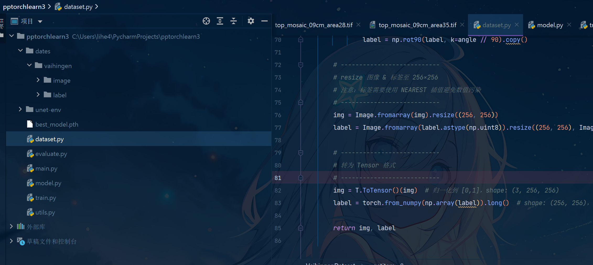
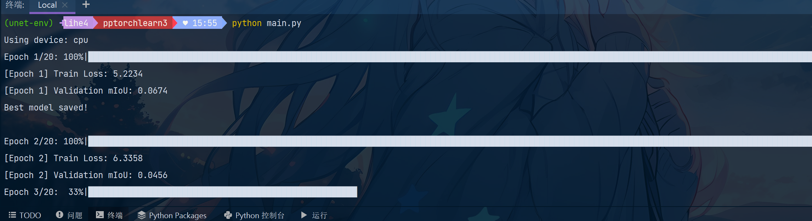

# 泰山第二次培训：UNet图像分割

# 目标

```python
学习pytorch，熟悉各种接口用法；能够搭建一个简单的深度学习模型，拥有训练流程。
```

## 任务二：UNet图像分割

使用 U-Net 模型进行图像分割，掌握图像分割的基本原理与实现方法

数据集：Vaihingen（含image和label）

```
# 类别与掩码颜色映射关系
CLASSES = ('ImSurf', 'Building', 'LowVeg', 'Tree', 'Car', 'Clutter')
PALETTE = [[255, 255, 255], [0, 0, 255], [0, 255, 255], [0, 255, 0], [255, 204, 0], [255, 0, 0]]
```

要求：有训练流程（包括读取数据集、数据增强、模型训练、模型评估，模型保存等）,数据增强方法不少于三种

评估指标：mIoU 平均交并比 (mIoU, Mean Intersection over Union)

定义: 所有类别的 IoU 的平均值。

公式:

			$\text{mIoU} = \frac{1}{C} \sum_{i=1}^{C} \text{IoU}_i $  

其中:

		C是类别的总数，${IoU}_i$是类别i的交并比。

‍

数据集目录层级：

```python
pptorchlearn3
│
├── dates
│   └── vaihingen
│       ├── image
│       │   ├── top_mosaic_09cm_area1.tif
│       │   ├── top_mosaic_09cm_area2.tif
│       │   ├── top_mosaic_09cm_area3.tif
│       │   ├── top_mosaic_09cm_area6.tif
│       │   ├── top_mosaic_09cm_area13.tif
│       │   ├── top_mosaic_09cm_area17.tif
│       │   ├── top_mosaic_09cm_area27.tif
│       │   ├── top_mosaic_09cm_area28.tif
│       │   ├── top_mosaic_09cm_area35.tif
│       │   └── top_mosaic_09cm_area37.tif
│       └── label
│           ├── top_mosaic_09cm_area1_noBoundary.tif
│           ├── top_mosaic_09cm_area2_noBoundary.tif
│           ├── top_mosaic_09cm_area3_noBoundary.tif
│           ├── top_mosaic_09cm_area6_noBoundary.tif
│           ├── top_mosaic_09cm_area13_noBoundary.tif
│           ├── top_mosaic_09cm_area17_noBoundary.tif
│           ├── top_mosaic_09cm_area27_noBoundary.tif
│           ├── top_mosaic_09cm_area28_noBoundary.tif
│           ├── top_mosaic_09cm_area35_noBoundary.tif
│           └── top_mosaic_09cm_area37_noBoundary.tif
```

## 实现

### 虚拟环境

```bash
python -m venv unet-env

unet-env\Scripts\activate  ##激活环境
```

### 安装依赖

```python
pip install torch torchvision torchaudio --index-url https://download.pytorch.org/whl/cpu
pip install numpy opencv-python matplotlib tqdm pillow
pip install scikit-learn
```

### 项目结构



‍

```python
pptorchlearn3/
├── unet_env/                # 虚拟环境目录（不上传）
├── dates/
│   └── vaihingen/           # 原始数据集
│       ├── image/
│       └── label/
├
│── dataset.py           # 数据集加载和预处理
│── model.py             # U-Net 模型
│── train.py             # 训练流程
│── evaluate.py          # mIoU评估逻辑
│── utils.py             # 常用工具函数
│── main.py              # 程序主入口
└── best_model.pth           # 保存的最佳模型（训练后生成）

```

---

### 各文件详细代码

 `dataset.py`​ - 数据加载与增强

```python
import os
import torch
from torch.utils.data import Dataset
from PIL import Image
import numpy as np
import torchvision.transforms as T
import random

# 颜色映射表：RGB颜色 -> 类别编号
PALETTE = {
    (255, 255, 255): 0,  # ImSurf
    (0, 0, 255): 1,      # Building
    (0, 255, 255): 2,    # LowVeg
    (0, 255, 0): 3,      # Tree
    (255, 204, 0): 4,    # Car
    (255, 0, 0): 5       # Clutter
}

def mask_to_class(mask):
    """
    将 RGB 掩码图像转换为整数标签矩阵
    每个像素点 RGB 匹配 PALETTE 中的某一类，映射为 0~5 的整数标签
    """
    mask = np.array(mask)  # (H, W, 3)
    label_mask = np.zeros(mask.shape[:2], dtype=np.int64)  # 初始化 label map

    for rgb, idx in PALETTE.items():
        matches = np.all(mask == rgb, axis=-1)  # 找出所有匹配某种颜色的位置
        label_mask[matches] = idx               # 设置为对应类别索引

    return label_mask  # 返回的是整数标签图 (H, W)


class VaihingenDataset(Dataset):
    def __init__(self, image_dir, label_dir, transform=True):
        """
        image_dir: 图像文件夹路径
        label_dir: 标签（掩码）文件夹路径
        transform: 是否应用数据增强（翻转/旋转）
        """
        self.image_paths = sorted([os.path.join(image_dir, f) for f in os.listdir(image_dir)])
        self.label_paths = sorted([os.path.join(label_dir, f) for f in os.listdir(label_dir)])
        self.transform = transform

    def __len__(self):
        return len(self.image_paths)

    def __getitem__(self, idx):
        # 加载图像（RGB）和标签掩码图像（RGB）
        img = Image.open(self.image_paths[idx]).convert('RGB')
        label = Image.open(self.label_paths[idx]).convert('RGB')

        # 转为 numpy 并进行颜色到类别的映射
        img = np.array(img)
        label = mask_to_class(label)  # 得到标签图 (H, W)，值域在 0~5

        # ---------------------------
        # 数据增强（3种：左右翻转，上下翻转，旋转）
        # ---------------------------
        if self.transform:
            if random.random() > 0.5:
                img = np.fliplr(img).copy()
                label = np.fliplr(label).copy()
            if random.random() > 0.5:
                img = np.flipud(img).copy()
                label = np.flipud(label).copy()
            if random.random() > 0.5:
                angle = random.choice([90, 180, 270])
                img = np.rot90(img, k=angle // 90).copy()
                label = np.rot90(label, k=angle // 90).copy()

        # ---------------------------
        # resize 图像 & 标签至 256×256
        # 注意：标签需要使用 NEAREST 插值避免数值污染
        # ---------------------------
        img = Image.fromarray(img).resize((256, 256))
        label = Image.fromarray(label.astype(np.uint8)).resize((256, 256), Image.NEAREST)

        # ---------------------------
        # 转为 Tensor 格式
        # ---------------------------
        img = T.ToTensor()(img)  # 归一化到 [0,1]，shape: (3, 256, 256)
        label = torch.from_numpy(np.array(label)).long()  # shape: (256, 256)，类型为 long

        return img, label

```

---

 `model.py`​ - U-Net 模型结构

```python
# model.py
import torch
import torch.nn as nn

# 两次卷积+激活模块
class DoubleConv(nn.Module):
    def __init__(self, in_c, out_c):
        super().__init__()
        self.conv = nn.Sequential(
            nn.Conv2d(in_c, out_c, 3, padding=1),
            nn.ReLU(inplace=True),
            nn.Conv2d(out_c, out_c, 3, padding=1),
            nn.ReLU(inplace=True)
        )

    def forward(self, x):
        return self.conv(x)

# U-Net 网络结构
class UNet(nn.Module):
    def __init__(self, n_classes):
        super().__init__()
        # 编码器部分
        self.down1 = DoubleConv(3, 64)
        self.pool1 = nn.MaxPool2d(2)
        self.down2 = DoubleConv(64, 128)
        self.pool2 = nn.MaxPool2d(2)
        self.down3 = DoubleConv(128, 256)
        self.pool3 = nn.MaxPool2d(2)
        self.down4 = DoubleConv(256, 512)
        self.pool4 = nn.MaxPool2d(2)

        # 编码器底部
        self.bottleneck = DoubleConv(512, 1024)

        # 解码器部分
        self.up1 = nn.ConvTranspose2d(1024, 512, 2, stride=2)
        self.conv1 = DoubleConv(1024, 512)
        self.up2 = nn.ConvTranspose2d(512, 256, 2, stride=2)
        self.conv2 = DoubleConv(512, 256)
        self.up3 = nn.ConvTranspose2d(256, 128, 2, stride=2)
        self.conv3 = DoubleConv(256, 128)
        self.up4 = nn.ConvTranspose2d(128, 64, 2, stride=2)
        self.conv4 = DoubleConv(128, 64)

        # 输出层
        self.out = nn.Conv2d(64, n_classes, 1)

    def forward(self, x):
        # 编码器流程
        d1 = self.down1(x)
        d2 = self.down2(self.pool1(d1))
        d3 = self.down3(self.pool2(d2))
        d4 = self.down4(self.pool3(d3))
        
        # 编码器底部
        bn = self.bottleneck(self.pool4(d4))

        # 解码器流程 + concat 跳跃连接
        u1 = self.conv1(torch.cat([self.up1(bn), d4], dim=1))
        u2 = self.conv2(torch.cat([self.up2(u1), d3], dim=1))
        u3 = self.conv3(torch.cat([self.up3(u2), d2], dim=1))
        u4 = self.conv4(torch.cat([self.up4(u3), d1], dim=1))
        return self.out(u4)

```

---

​`evaluate.py`​ - mIoU 评估指标计算

```python
# evaluate.py
import torch
import numpy as np

# 计算 mean IoU 指标
def compute_mIoU(pred, label, num_classes):
    ious = []
    pred = pred.cpu().numpy()
    label = label.cpu().numpy()
    for cls in range(num_classes):
        pred_inds = (pred == cls)
        label_inds = (label == cls)
        intersection = np.logical_and(pred_inds, label_inds).sum()
        union = np.logical_or(pred_inds, label_inds).sum()
        if union == 0:
            ious.append(float('nan'))
        else:
            ious.append(intersection / union)
    return np.nanmean(ious)

```

---

​`utils.py`​ - 模型保存与加载

```python
# utils.py
import torch

# 保存模型
def save_model(model, path):
    torch.save(model.state_dict(), path)

# 加载模型
def load_model(model, path, device):
    model.load_state_dict(torch.load(path, map_location=device))
    return model
```

---

​`train.py`​ - 模型训练逻辑

```python
# train.py
import torch
import torch.nn as nn
from torch.utils.data import DataLoader
from tqdm import tqdm
from evaluate import compute_mIoU
from utils import save_model

# 模型训练函数，支持自定义 epoch、学习率、batch_size

def train(model, train_set, val_set, device, num_epochs=20, lr=1e-3, batch_size=4):
    # 数据加载器
    train_loader = DataLoader(train_set, batch_size=batch_size, shuffle=True)
    val_loader = DataLoader(val_set, batch_size=2)

    # 损失函数和优化器
    criterion = nn.CrossEntropyLoss()
    optimizer = torch.optim.Adam(model.parameters(), lr=lr)

    best_miou = 0
    for epoch in range(num_epochs):
        model.train()
        total_loss = 0
        # 训练阶段
        for img, label in tqdm(train_loader, desc=f"Epoch {epoch+1}/{num_epochs}"):
            img, label = img.to(device), label.to(device)
            out = model(img)
            loss = criterion(out, label)
            optimizer.zero_grad()
            loss.backward()
            optimizer.step()
            total_loss += loss.item()

        print(f"[Epoch {epoch+1}] Train Loss: {total_loss:.4f}")

        # 验证阶段
        model.eval()
        all_pred, all_label = [], []
        with torch.no_grad():
            for img, label in val_loader:
                img = img.to(device)
                pred = model(img).argmax(1).cpu()
                all_pred.append(pred)
                all_label.append(label)

        preds = torch.cat(all_pred)
        labels = torch.cat(all_label)
        miou = compute_mIoU(preds, labels, num_classes=6)
        print(f"[Epoch {epoch+1}] Validation mIoU: {miou:.4f}")

        # 保存最优模型
        if miou > best_miou:
            best_miou = miou
            save_model(model, 'best_model.pth')
            print("Best model saved!\n")

```

---

​`main.py`​ - 主运行入口

```python
import argparse
import torch
from dataset import VaihingenDataset
from model import UNet
from train import train
from utils import load_model

def main():
    # 命令行参数解析
    parser = argparse.ArgumentParser()
    parser.add_argument('--mode', choices=['train', 'eval'], default='train')
    parser.add_argument('--data_dir', type=str, default='./dates/vaihingen')
    parser.add_argument('--model_path', type=str, default='best_model.pth')
    parser.add_argument('--epochs', type=int, default=20)
    parser.add_argument('--lr', type=float, default=1e-3)
    parser.add_argument('--batch_size', type=int, default=4)
    args = parser.parse_args()

    device = torch.device("cuda" if torch.cuda.is_available() else "cpu")
    print("Using device:", device)

    # 设置图像和标签路径
    img_dir = f'{args.data_dir}/image'
    label_dir = f'{args.data_dir}/label'

    # 加载数据集
    train_set = VaihingenDataset(img_dir, label_dir, transform=True)
    val_set = VaihingenDataset(img_dir, label_dir, transform=False)

    # 初始化模型
    model = UNet(n_classes=6).to(device)

    if args.mode == 'train':
        train(model, train_set, val_set, device, num_epochs=args.epochs, lr=args.lr, batch_size=args.batch_size)
    elif args.mode == 'eval':
        model = load_model(model, args.model_path, device)
        print("模型加载完成，后续可添加测试代码。")

if __name__ == "__main__":
    main()

```

---

### 参数说明：

|参数|类型|默认值|说明|
| ------| -------| --------| ----------------------------------------------|
|​`--mode`​|str|​`'train'`​|运行模式：`'train'`​训练，`'eval'`​评估|
|​`--data_dir`​|str|​`'./dates/vaihingen'`​|数据集的根目录（包含 image 和 label 文件夹）|
|​`--model_path`​|str|​`'best_model.pth'`​|模型保存或加载的文件路径|
|​`--epochs`​|int|​`20`​|训练轮数|
|​`--batch_size`​|int|​`4`​|每批次训练样本数量（越大占显存越多）|
|​`--lr`​|float|​`0.001`​|学习率，控制模型参数更新步长|

### 运行训练

```bash

python main.py --mode train --data_dir ./dates/vaihingen --model_path best_model.pth --epochs 30 --batch_size 8 --lr 0.0005
## 指定参数
python main.py  ## 不指定
```

---

### 补充说明

- 数据增强包括了：

  - 随机水平翻转
  - 随机垂直翻转
  - 随机旋转
- 模型保存路径：`best_model.pth`​
- 评估指标：mIoU，按6个类分别计算 IoU 后取均值

---



等待训练结束即可。

---

‍
