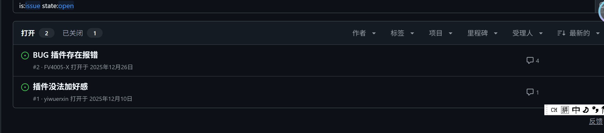
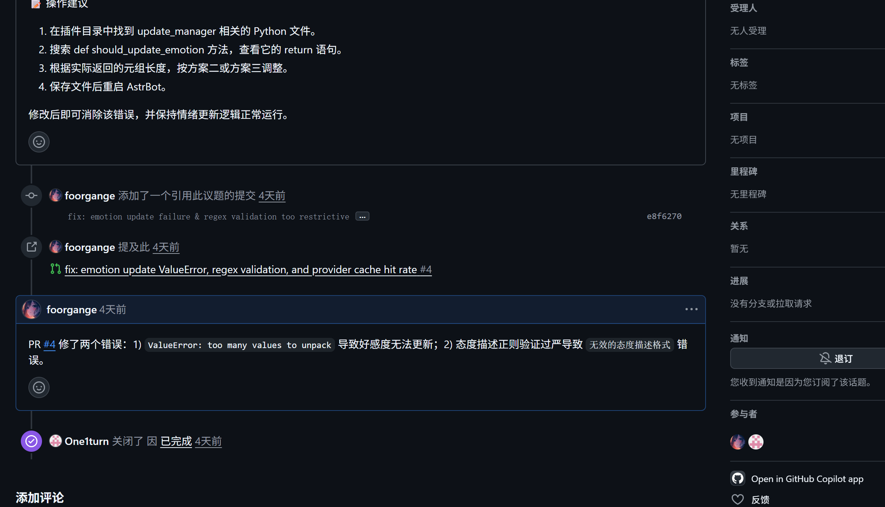
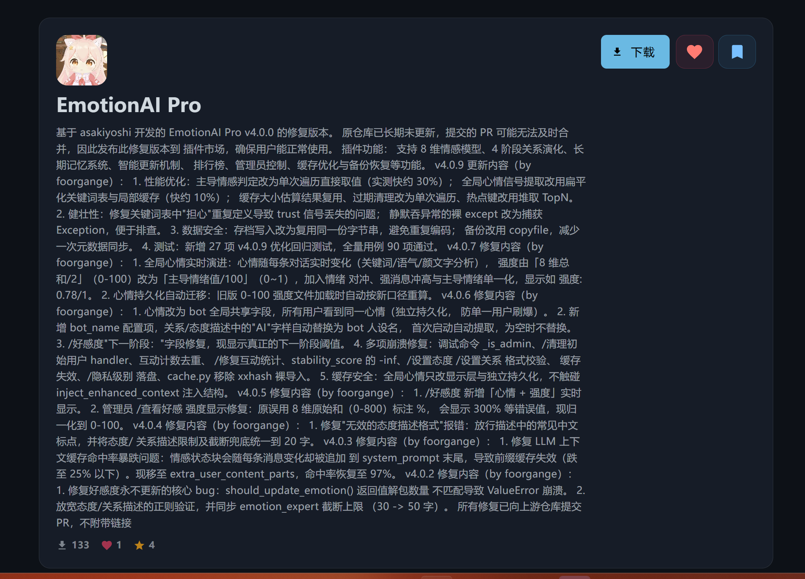

# Astrbot 好感度插件推荐：EmotionAI Pro

## Astrbot 好感度插件推荐：astrbot-plugin-emotionai\_pro

```yaml
https://github.com/foorgange/astrbot-plugin-emotionai_pro（项目地址）
```

当你购置了云服务器，并使用docker在服务器上部署了astrbot与napcat，并且做了必要的配置搞了一个自己的qq bot后，你需要的就是完善丰富这个bot的玩法了，这时候astrbot的插件市场就是一个不可或缺的选择。

为了让我的qq bot情感更加丰富和增加一些养成系内容，我看中了这个插件：


但在使用过程中我发现这个插件有不少bug,如好感度无法正常更新，接入deepseekV4falsh缓存命中率过低等等。

我翻看原仓库的issue,发现类似的问题也早有朋友提出，但作者一直没有修复，我就提了相关pr






但是由于作者插件已经很久没有更新，作者github也很久不活跃，我就另外将该仓库fork了一份，修改后添加声明将其上传到astrbot的插件市场了



```rust
基于 asakiyoshi 开发的 EmotionAI Pro v4.0.0 的修复版本。 原仓库已长期未更新，提交的 PR 可能无法及时合并，因此发布此修复版本到 插件市场，确保用户能正常使用。 插件功能： 支持 8 维情感模型、4 阶段关系演化、长期记忆系统、智能更新机制、 排行榜、管理员控制、缓存优化与备份恢复等功能。 v4.0.9 更新内容（by foorgange）： 1. 性能优化：主导情感判定改为单次遍历直接取值（实测快约 30%）； 全局心情信号提取改用扁平化关键词表与局部缓存（快约 10%）； 缓存大小估算结果复用、过期清理改为单次遍历、热点键改用堆取 TopN。 2. 健壮性：修复关键词表中"担心"重复定义导致 trust 信号丢失的问题； 静默吞异常的裸 except 改为捕获 Exception，便于排查。 3. 数据安全：存档写入改为复用同一份字节串，避免重复编码； 备份改用 copyfile，减少一次元数据同步。 4. 测试：新增 27 项 v4.0.9 优化回归测试，全量用例 90 项通过。 v4.0.7 修复内容（by foorgange）： 1. 全局心情实时演进：心情随每条对话实时变化（关键词/语气/颜文字分析）， 强度由「8 维总和/2」（0-100）改为「主导情绪值/100」（0~1），加入情绪 对冲、强消息冲高与主导情绪单一化，显示如 强度: 0.78/1。 2. 心情持久化自动迁移：旧版 0-100 强度文件加载时自动按新口径重算。 v4.0.6 修复内容（by foorgange）： 1. 心情改为 bot 全局共享字段，所有用户看到同一心情（独立持久化， 防单一用户刷爆）。 2. 新增 bot_name 配置项，关系/态度描述中的"AI"字样自动替换为 bot 人设名， 首次启动自动提取，为空时不替换。 3. /好感度"下一阶段："字段修复，现显示真正的下一阶段阈值。 4. 多项崩溃修复：调试命令 _is_admin、/清理初始用户 handler、互动计数去重、 /修复互动统计、stability_score 的 -inf、/设置态度 /设置关系 格式校验、 缓存失效、/隐私级别 落盘、cache.py 移除 xxhash 裸导入。 5. 缓存安全：全局心情只改显示层与独立持久化，不触碰 inject_enhanced_context 注入结构。 v4.0.5 修复内容（by foorgange）： 1. /好感度 新增「心情 + 强度」实时显示。 2. 管理员 /查看好感 强度显示修复：原误用 8 维原始和（0-800）标注 %， 会显示 300% 等错误值，现归一化到 0-100。 v4.0.4 修复内容（by foorgange）： 1. 修复"无效的态度描述格式"报错：放行描述中的常见中文标点，并将态度/ 关系描述限制及截断兜底统一到 20 字。 v4.0.3 修复内容（by foorgange）： 1. 修复 LLM 上下文缓存命中率暴跌问题：情感状态块会随每条消息变化却被追加 到 system_prompt 末尾，导致前缀缓存失效（跌至 25% 以下）。现移至 extra_user_content_parts，命中率恢复至 97%。 v4.0.2 修复内容（by foorgange）： 1. 修复好感度永不更新的核心 bug：should_update_emotion() 返回值解包数量 不匹配导致 ValueError 崩溃。 2. 放宽态度/关系描述的正则验证，并同步 emotion_expert 截断上限 （30 -> 50 字）。 所有修复已向上游仓库提交 PR，不附带链接
```

### 完整readme文件（项目介绍）

## EmotionAI Pro - 融合版情感智能插件 v4.0.4

> 融合 [EmotionAI](https://github.com/tengtian3/astrbot-plugin-emotionai) 与 [FavourPro](https://github.com/Catfish872/astrbot_plugin_favourpro) 精华，并加入「智能更新 · 辅助 LLM · 长期记忆 · 负好感支持 · 过渡保护」五大革新，打造**真实、渐进、可养成**的 AI 情感交互系统。

---

### 更新日志

#### v4.0.10（缓存崩溃 + 情感分析模型选择修复）

**修复两个"环境一变就出事"的隐患，不改动情感算法与上下文注入结构。**

1. **修复 xxhash ≥ 4.0 下分片缓存整体崩溃**（`cache.py`）
    `_get_shard()` 直接把 `str` 传给 `xxhash.xxh64()`，旧版 xxhash（3.x）会隐式接受字符串，
    但 4.0 起会抛 `TypeError: Strings must be encoded before hashing`，导致缓存层完全不可用。
    现统一编码为 `bytes`；已实测 xxhash 3.x 下 `xxh64(str)` 与 `xxh64(bytes)` 结果一致，
    因此对现有部署是**行为等价**的修复。
2. **修复情感分析模型选择完全失效**（`emotion_expert.py`）
    读取 provider 元信息时用了并不存在的 `provider.name` 属性，取不到便退化成类名
    （如 `ProviderOpenAIOfficial`），于是：

   - `secondary_llm_provider` 配置项**完全失效**；
   - 名称匹配永远不命中，最终落到 `providers[0]`。

   线上实测落到的是视觉模型 `Qwen/Qwen3-VL-30B-A3B-Instruct`，而非配置声明的
    `商汤/deepseek-v4-flash`。现改为读取 `meta()`，并按配置项说明
    「留空则使用主 LLM」的语义补齐选择顺序：
    显式配置 → 主 LLM → 名称含 deepseek/default → 第一个可用。
3. **修复主 LLM 解析取错配置**（`emotion_expert.py` + `main.py`）
    调用 `get_using_provider()` 时未传 `umo`，AstrBot 会退回读**全局**
    `cmd_config.json` 的 `default_provider_id`；而实际生效的是 WebUI 里的
    配置档案（如 `ds-flash`），两者可能指向完全不同的 provider。
    线上就因此拿到了一个已失效的 provider（`400 Model is unavailable`），
    导致情感分析每次静默退化为关键词兜底。现从事件透传 `umo`。
4. **`secondary_llm_model` 死配置修复**
    该配置项此前从未被读取。现通过 `text_chat(model=...)` 真正生效。
5. **测试**

   - 修复「模拟 xxhash 缺失」用例无效的问题：仅把 `xxhash` 从 `sys.modules` 弹出
      无法阻止 reload 时重新导入，需将其置为 `None`；
   - 新增 `tests/test_provider_resolution.py`（20 项）与分片哈希用例（1 项），
      覆盖 provider 元信息读取、选择优先级、`umo` 透传、`model` 透传，
      全量 **126 项测试通过**。

**涉及文件**：`cache.py`、`emotion_expert.py`、`main.py`、`tests/test_misc.py`、`tests/test_provider_resolution.py`

#### v4.0.9（性能优化 + 健壮性修复）

**版本号提升，并对非核心路径做了性能与代码质量优化（不改动情感算法与上下文注入逻辑）。**

1. **主导情感判定更快**：`get_dominant()` 由「构造中文键字典 + 两次遍历」改为直接属性取值 + 单次比较，实测约快 30%；`get_summary()` 约快 10%。
2. **心情信号提取更快**：关键词表预先扁平化为 tuple 元组，内层改用局部变量缓存 `dict.get`，长句约快 10%。行为完全一致。
3. **缓存效率**：
   - `set()` 的条目大小只估算一次，供「删除旧值 / 内存校验 / 写入」三处复用；
   - `cleanup_expired()` 由「先建列表再逐个删除」改为单次遍历 + `pop`，并保证 `total_size` 不为负；
   - `get_stats()` 热点键由「全量排序取前 10」改为 `heapq.nlargest`。
4. **关键词表 bug 修复**：`"担心"` 在表中被重复定义（第二次覆盖了第一次），导致信任信号丢失；现合并为 `{"trust": 1, "fear": 1}`。
5. **存档写入优化**：序列化结果编码为字节串后复用给写盘与校验和，避免重复编码；备份由 `copy2` 改为 `copyfile`，省去一次元数据同步。
6. **异常处理**：3 处静默吞错的裸 `except:` 改为 `except Exception:`，便于定位问题。
7. **测试**：新增 `tests/test_v409_optimizations.py` 共 27 项回归用例，全量 90 项测试通过。

**涉及文件**：`models.py`、`global_mood.py`、`cache.py`、`storage.py`、`main.py`、`tests/test_v409_optimizations.py`

> 基准数据见 `benchmarks/bench_comparison.py`（micro-benchmark，机器不同会有差异）。

#### v4.0.8.1

**版本号提升（元数据与代码内版本号统一）。**

#### v4.0.8

**版本号提升，避免插件市场更新冲突；精简插件描述。**

#### v4.0.7（心情实时演进 + 强度 0~1）

**bot 心情现在随每条对话实时变化，强度改为 0~1**

1. **实时演进**：旧版心情只在情感更新触发时变化，普通对话不变；新版在每条对话后做轻量关键词/语气/颜文字分析，实时叠加到全局心情。
2. **强度口径改为 0~1**：旧强度用「8 维情绪总和/2」（0-100），对情绪转移不敏感（被骂时 joy 降、anger 升，总和几乎不变，强度纹丝不动）。新强度 = 主导情绪值/100（0~1），被骂时主导从喜悦切到厌恶，强度立即变化。显示如 `强度: 0.78/1`。
3. **情绪对冲**：负面赢时正面情绪 ×0.2 压制、正面赢时负面 ×0.2，主导情绪真正翻转（「我讨厌你」→ 从喜悦转向厌恶）。
4. **强消息冲高**：一条强烈消息直接冲到高强度档位（0.4~0.8），弱信号温和叠加，防单用户刷爆。
5. **主导情绪单一化**：只冲高信号最强的单一维度，不产生「复合情绪」（人不会同时有好几种心情）。
6. **持久化自动迁移**：旧版 0-100 强度的 global\_mood.json 加载时自动按新口径重算。
7. **缓存安全**：心情演进只发生在 `on_llm_response`（对话后），不触碰 `extra_user_content_parts` 注入结构，LLM 前缀缓存命中率不受影响。

**涉及文件**：`global_mood.py`、`main.py`、`command_handlers.py`

#### v4.0.6（共同心情 + bot 人设名 + 崩溃修复）

**`/好感度` 现在显示 bot 全局共享心情，描述不再出现「AI」字样**

1. **共同心情（全局共享字段）**：心情不再是每个用户各自的 8 维情绪，而是 bot 基于对话/事件变化的**全局心情**，所有用户看到同一个心情与强度。全局心情独立持久化（`global_mood.json`），各用户的情感更新温和叠加（衰减 + clamp），防止单一用户刷爆。
2. **`bot_name` 配置项**：关系/态度描述中的「AI」字样自动替换为 bot 人设名（如「雏草姬和塔菲」而非「亲密玩闹的ai伙伴」）。首次启动自动从 AstrBot persona 提取人设名（如「永雏塔菲」），也可在配置中手动修改。`bot_name` 为空时不替换，保持原文。
3. **`下一阶段：` 字段修复**：`/好感度` 详细模式原显示的「下一阶段阈值」实为**当前阶段**阈值，现改为真正的下一阶段阈值；共生期显示「已达最高阶段」，负好感显示「恢复正常关系」。基础模式也补上该字段。
4. **崩溃修复**：
   - 调试命令（`/缓存统计` `/调试事件` `/调试记忆` `/修复互动统计` `/清理初始用户`）不再因缺少 `_is_admin` 崩溃（AttributeError）
   - `/清理初始用户` 接错 handler 已修复
   - 互动计数去重：一次触发情感更新的对话不再被计 2 次；无情感更新的普通对话不再计入互动次数（互动次数反映「有情感影响的对话」）
   - `/修复互动统计` 现在正确设置负面互动数（`positive + negative = total`）
   - `stability_score` 不再出现 `-inf`（从未互动的用户）
   - `/设置态度` `/设置关系` 现在校验格式并返回友好错误信息
   - `/设置好感` `/设置亲密` `/重置好感` 写命令后缓存立即失效，不再残留旧状态
   - `/隐私级别` 现在持久化到磁盘，重启不丢失
   - `cache.py` 移除 `xxhash` 裸导入，无 `xxhash` 环境自动降级 `hashlib`
5. **缓存安全**：全局心情只改用户可见显示层 + 独立全局持久化，**不触碰** `inject_enhanced_context` 的注入结构（仍在 `extra_user_content_parts` 之后），缓存命中率不受影响。

**涉及文件**：`global_mood.py`（新增）、`main.py`、`command_handlers.py`、`relationship_manager.py`、`emotion_expert.py`、`config.py`、`managers.py`、`cache.py`、`storage.py`

#### v4.0.5（心情强度显示）

**「好感度」命令现在实时显示 bot 当前心情与强度**

1. `/好感度` 命令（及对话后的状态显示）新增「心情 + 强度」行：心情来自 8 维情绪模型的主导情感（如喜悦/愤怒/复合），强度归一化到 0-100，并附中文心情描述（心情平静/平稳/微动/波动/情绪高涨）。
2. 管理员 `/查看好感` 命令的情感强度显示修复：原先误用 8 维情绪原始和（0-800）并标注 `%`，会出现「情感强度: 300%」这类错误值，现已归一化到 0-100。
3. 强度口径与 LLM 注入上下文一致（`_get_emotion_intensity`），显示与 AI 语气完全同步。
4. 不涉及 LLM 请求注入路径，缓存命中率不受影响（仍在 `extra_user_content_parts` 之后）。

**涉及文件**：`main.py`、`command_handlers.py`

#### v4.0.4（态度描述修复）

**修复「无效的态度描述格式」报错**

**根因**：验证正则 `^[\w\-\s一-龥]{1,50}$` 只允许汉字/字母数字/空格/连字符，**不允许任何中文标点**。但 AI 生成的自然中文描述几乎必带标点（，。！？），即使之前把长度上限从 20 放宽到 50，带标点的描述依然被正则拒绝，导致情感更新整体失败。

**修复**：

1. `models.py`：正则允许常见中文标点（，。！？、；：“”‘’《》·）
2. `emotion_expert.py`：情感分析提示词要求态度/关系描述**不超过 20 字**，禁止逗号连接的长句；截断兜底从 50 字同步降到 20 字

**效果**：态度/关系描述正常更新（如「俏皮调侃带点宠溺」「复读机冠军与颁奖AI」），`无效的态度描述格式` 报错清零。描述也更简短，符合人类社交习惯。

**涉及文件**：`models.py`、`emotion_expert.py`

#### v4.0.3（缓存命中率修复）

**修复 LLM 上下文缓存命中率暴跌的核心问题**

情感状态块（好感度/亲密度/情绪值/互动次数）几乎每条消息都会变化，但原版本将其追加到 **system\_prompt** 末尾。DeepSeek 等提供商使用**前缀缓存**，system\_prompt 位于消息数组最前面，任何数字变化都会使后续所有历史 token 的缓存全部失效，导致缓存命中率跌至 25% 甚至 0%。

**修复**：将情感上下文从 `system_prompt` 移动到 `extra_user_content_parts`（当前用户消息之后）。system\_prompt + 历史消息前缀保持稳定，只有末尾一小段变化。实测缓存命中率从 ~25% 恢复到 **97%**。

**涉及文件**：`main.py`

#### v4.0.2（bug 修复）

1. **修复好感度永远不更新**：`should_update_emotion()` 返回 3 个值 `(bool, str, int)`，但调用处只解包了 2 个，导致每次触发更新都抛 `ValueError` 崩溃。已在 `main.py` 修复解包数量。
2. **修复态度/关系描述正则验证过严**：原限制 20/30 字，中文 AI 生成的描述频繁超长被拒，报「无效的态度描述格式」。已放宽到 50/80 字（`models.py`）。
3. **同步态度截断上限**：`emotion_expert.py` 中态度文本截断从 30 字同步到 50 字，与验证规则一致。

**涉及文件**：`main.py`、`models.py`、`emotion_expert.py`

---

### 核心亮点

| 特性类别 | 亮点说明 |
| --- | --- |
| **双重情感系统** | 保留 8 维情感 + 好感/亲密度双核，新增「复合评分」「动态权重」与「负好感专属权重」 |
| **真实心理模拟** | AI 自主生成态度/关系描述，新增「辅助 LLM 情感分析专家」与「长期记忆轨迹」，避免数值跳变 |
| **关系阶段系统** | 四阶段（初识→深化→承诺→共生）新增「滞后带过渡保护」「亲密度增益」与「阶段进度百分比」 |
| **智能更新机制** | 不再依赖尾部标记：①关键词情绪强度 ②时间阈值 ③强制计数器 ④主 LLM 标记 四维决策 |
| **高交互性** | 排行榜、阶段分析、情感档案、隐私控制，新增「缓存统计」「数据备份/修复」「调试事件/记忆」 |
| **隐私与性能** | TTL 缓存、异步自动保存、数据迁移、全局隐私级别，新增「负好感惩罚」「抵御操纵提示」 |

---

### 使用指南

#### 用户命令

| 命令 | 说明 |
| --- | --- |
| `/好感度` | 查看当前情感状态（群聊显示用户标识，含过渡进度） |
| `/状态显示` | 切换是否在对话后显示状态信息 |
| `/好感排行 [n]` | 查看 TOP n 情感排行榜（最多 20） |
| `/负好感排行 [n]` | 查看 BOTTOM n 情感排行榜 |
| `/关系阶段` | 显示当前阶段、动态权重、过渡状态与进阶建议 |
| `/缓存统计` | 查看缓存命中率、条目数、访问次数 |

#### 管理员命令

| 命令 | 说明 |
| --- | --- |
| `/设置好感 <ID> <val>` | 设置好感度（-100~100） |
| `/设置亲密 <ID> <val>` | 设置亲密度（0~100） |
| `/设置态度 <ID> <文本>` | 自定义态度描述 |
| `/设置关系 <ID> <文本>` | 自定义关系描述 |
| `/重置好感 <ID>` | 重置为默认值 |
| `/查看好感 <ID>` | 查看完整档案（含维度、过渡、记忆） |
| `/隐私级别 <0-2>` | 0=完全保密 1=基础 2=详细 |
| `/重置插件` | 清空所有数据 |
| `/备份数据` | 创建快照（含长期记忆） |
| `/修复互动统计` | 依据好感/亲密度自动修正正负互动次数 |
| `/调试事件` | 输出事件结构（排障） |
| `/调试记忆` | 查看短期缓存与长期记忆详情 |

---

### 配置说明（`_conf_schema.json`）

| 配置键 | 说明 | 默认值 |
| --- | --- | --- |
| `enable_attitude_system` | 启用 FavourPro 态度关系系统 | `true` |
| `enable_ai_text_generation` | AI 自主生成态度/关系描述 | `true` |
| `enable_secondary_llm` | 启用辅助 LLM 做情感分析 | `true` |
| `enable_smart_update` | 四维智能更新（关键词+时间+计数+标记） | `true` |
| `force_update_interval` | 强制更新间隔（对话次数） | `5` |
| `emotional_significance_threshold` | 记入长期记忆的分数阈值 | `5` |
| `global_privacy_level` | 全局隐私级别（0~2） | `1` |
| `session_based` | 是否按会话隔离情感 | `false` |

#### 动态权重与过渡保护

| 阶段 | 好感权重 | 亲密权重 | composite 阈值 | 过渡缓冲 | 亲密度增益 |
| --- | --- | --- | --- | --- | --- |
| 初识期 | 70 % | 30 % | 25 | 3 分 | ×4.0 |
| 深化期 | 50 % | 50 % | 55 | 5 分 | ×3.6 |
| 承诺期 | 30 % | 70 % | 80 | 7 分 | ×3.0 |
| 共生期 | 50 % | 50 % | 95 | 10 分 | ×1.0 |

- **滞后带**：上升阈值 > 下降阈值，防止阶段抖动
- **保护分**：过渡期间复合评分不会低于前一段最高值
- **增益**：过渡期亲密度成长倍率提升，助力平滑进阶

---

### 设计理念

> 不是简单“好感度加减”，而是「**真实·渐进·可养成·可运维**」的 AI 内心世界。

#### 保留

- 8 维情感模型与异步高性能架构
- AI 自主文本评估与真实心理模拟
- 完备管理工具与排行榜体系

#### 新增

1. **智能更新**：四维判断（关键词/时间/计数/LLM 标记），无需等待尾部标记
2. **辅助 LLM**：独立情感分析专家，结合长期记忆与最近 3 轮对话，第一人称口语生成态度/关系描述
3. **长期记忆**：短期 TTL + 长期落盘 + 重要事件队列，跨重启保留关系轨迹
4. **负好感支持**：负好感阶段专属权重（好感 100 %）与描述策略，支持“冷淡/反感/敌对”三档
5. **过渡保护**：滞后带 + 保护分 + 亲密度增益，阶段跃迁平滑不掉级
6. **缓存与备份**：TTL 命中率统计、自动保存、数据备份与迁移、互动统计修复
7. **隐私与运维**：全局隐私级别、抵御操纵提示、调试事件/记忆指令、异步锁粒度优化

---

### 结语

\*\*EmotionAI Pro \*\* 不只是一个“好感度插件”，而是一个：

> **真实可养成的 AI 内心世界**
>  **渐进式关系演进系统**
>  **高可用情感交互框架**

无论是群聊互动、私聊陪伴，还是角色扮演、剧情养成，都能让你的 AI 拥有**细腻、自然、可持续**的情感表达与关系变化。
