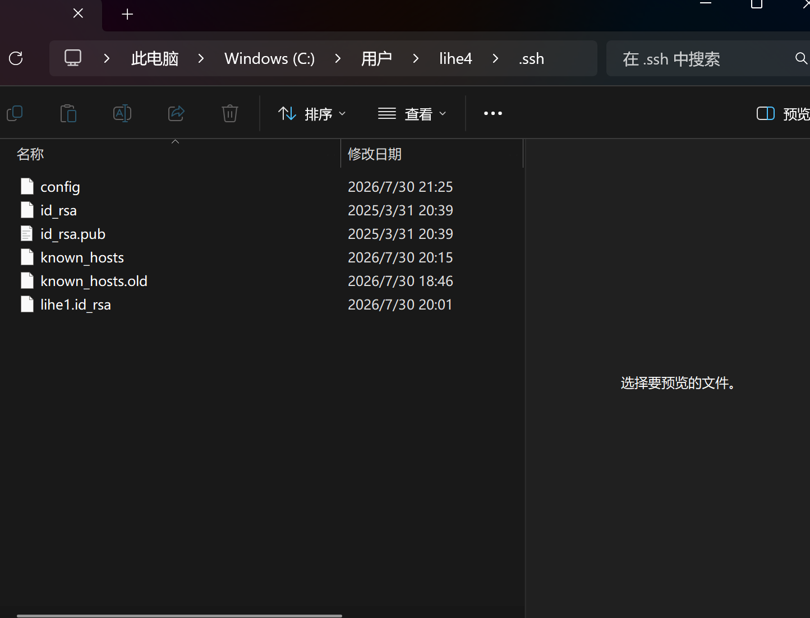
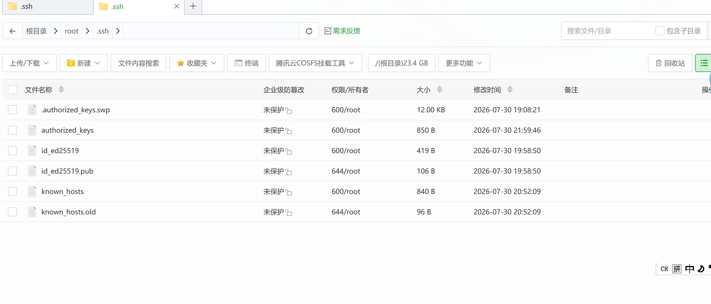
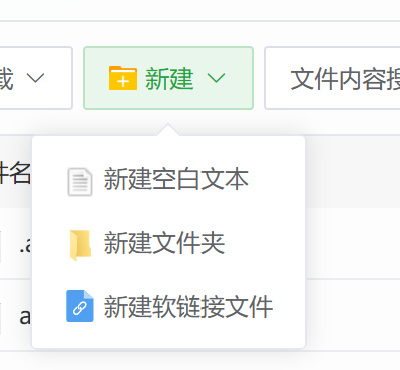

# ssh远程连接服务器教程

## ssh远程连接服务器教程

#### **检查是否已有 SSH 密钥**

首先，你需要确认本地是否已经生成了 SSH 密钥。如果没有，可以按照以下步骤生成。

##### **生成 SSH 密钥（如果没有）**

1. 打开终端（命令行），然后输入以下命令来生成新的 SSH 密钥对：

   ```bash
   ssh-keygen -t rsa -b 4096 -C "your_email@example.com"
   ```

   这里的 `your_email@example.com` 是你 GitHub 注册账户的邮箱。
2. 然后会提示你选择保存密钥的路径，一般直接按回车键，默认路径是 `~/.ssh/id_rsa`。
3. 如果提示设置密码（passphrase），你可以选择为空，或者设置一个密码。
4. 完成后，你的 SSH 密钥会生成在 `~/.ssh/` 目录下：

   - 公钥：`id_rsa.pub`
   - 私钥：`id_rsa`



| 文件 | 作用 |
| --- | --- |
| **config** | SSH 连接配置文件，可以给不同服务器设置别名、私钥路径、端口、用户名，直接`ssh 别名`就能连接，不用每次敲一长串参数 |
| **id\_rsa** | **RSA 私钥**，极其重要，不能泄露，用来身份认证，不要发给别人 |
| **id\_rsa.pub** | **RSA 公钥**​，可以公开，把它内容写到服务器`~/.ssh/authorized_keys`，实现免密登录 |
| **known\_hosts** | 已知主机清单。第一次连服务器会把服务器公钥存这里，防止中间人攻击；服务器重装系统后会报密钥冲突 |
| **known\_hosts.old** | known\_hosts 的备份旧文件，更新 known\_hosts 时自动生成 |
| **lihe1.id\_rsa** | 自定义命名的私钥文件，多套密钥场景使用，一般在 config 里指定使用这个私钥连接特定服务器 |

```cpp
其中id_rsa与id_rsa.pub就是我们生成的密钥对
```

#### 服务器端

这里我以宝塔运维的文件管理面板为例



| 文件 | 功能说明 | 权限（图中） |
| --- | --- | --- |
| `.authorized_keys.swp` | vim 编辑`authorized_keys`产生的临时交换文件，编辑异常残留，可以直接删除 | 600/root |
| **authorized\_keys** | ✅​**核心文件**​，存放所有客户端的​**公钥 (.pub 内容)** ​。客户端私钥匹配这里的公钥，即可免密登录服务器。权限必须严格`600`，权限过大 SSH 会拒绝免密登录 | 600/root |
| `id_ed25519` | ed25519 算法私钥，服务器本机生成的密钥，一般本机 ssh 连接别的机器使用，不要泄露 | 600/root |
| `id_ed25519.pub` | ed25519 对应的公钥，可以公开 | 644/root |
| `known_hosts` | 记录本机连接过的其他服务器公钥，防止中间人攻击 | 600/root |
| `known_hosts.old` | known\_hosts 更新时自动生成的备份文件 | 644/root |

```cpp
id_ed25519与id_ed25519.pub是服务器自带的密钥对，而authorized_keys则是我们需要创建的文件
```

#### **authorized\_keys文件创建**

```lua
客户端电脑                         服务器

id_rsa 私钥  ---------------->  authorized_keys(保存 id_rsa.pub)
```

我们需要做的就是把我们本机的id\_rsa.pub公钥文件的内容放到服务器的authorized\_keys文件内，这样当我们通过ssh连接时才会私钥验证成功 —— 允许登录。

##### 法一



可以通过宝塔面版图形化创建**authorized\_keys文件**随后把本机的公钥文件的内容完整复制到里面即可

内容示例

```ruby
ssh-rsa sdifsfidsi(一串字符串，已作脱敏处理，这是我们添加进去的本地电脑公钥)
ssh-ed25519 AAAA3N1lZDI1(一串字符串，已作脱敏处理，这个是服务器自带的自己的公钥)
```

##### 法二 手动创建 authorized\_keys

###### 1. 进入 SSH 配置目录

服务器执行：

```
cd ~/.ssh
```

如果不存在：

```
mkdir ~/.ssh
```

设置目录权限：

```
chmod 700 ~/.ssh
```

---

###### 2. 创建 authorized\_keys 文件

创建：

```
touch authorized_keys
```

或者直接：

```
vim authorized_keys
```

---

###### 3. 写入客户端公钥

打开本地电脑：

查看公钥：

```
使用记事本打开id_rsa.pub
```

例如：

```
ssh-rsa AAAABaC1yc2EAAAADAQAAACAQC...... user@email.com
```

复制​**完整一行内容**。

进入服务器：

```
vim ~/.ssh/authorized_keys
```

粘贴：

```
ssh-rsa AAAAB3aC1yc2EADAQABAAACAQC...... user@email.com
```

保存：

vim：

```
Esc

:wq

Enter
```

---

###### 4. 设置 authorized\_keys 权限

SSH 对权限要求严格。

执行：

```
chmod 600 ~/.ssh/authorized_keys
```

查看：

```
ls -l ~/.ssh
```

正常：

```
-rw------- 1 root root authorized_keys
```

表示：

```
所有者(root)：读 + 写
其他用户：无权限
```

#### 后续连接使用

```ruby
ssh -i C:\Users\le4\.ssh\id_rsa root@1x4.xxx.xxx.x8
ssh -i 私钥路径 用户名@服务器IP
```

打开你的cmd执行这条命令就可以远程操作服务器了！

##### 连接的同时执行命令在服务器

```cpp
ssh -i 私钥 用户名@服务器IP "服务器命令"
```

###### 查看服务器目录

例如查看 `/root`：

```
ssh -i C:\Users\le4\.ssh\id_rsa root@1x4.xxx.xxx.x8 "ls /root"
```

---

###### 执行多个命令

用 `&&`：

```
ssh -i C:\Users\le4\.ssh\id_rsa root@1x4.xxx.xxx.x8 "cd /root && ls"
```

等价于服务器执行：

```
cd /root
ls
```

---

###### 启动服务

例如启动 Docker：

```
ssh -i C:\Users\le4\.ssh\id_rsa root@1x4.xxx.xxx.x8 "systemctl start docker"
```

查看状态：

```
ssh -i C:\Users\le4\.ssh\id_rsa root@1x4.xxx.xxx.x8 "systemctl status docker"
```

---

###### 执行服务器脚本

比如服务器有：

```
/root/start.sh
```

本地：

```
ssh -i C:\Users\le4\.ssh\id_rsa root@1x4.xxx.xxx.x8 "bash /root/start.sh"
```
