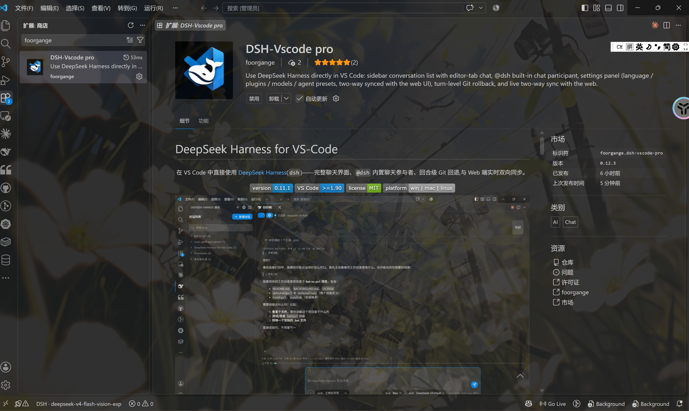
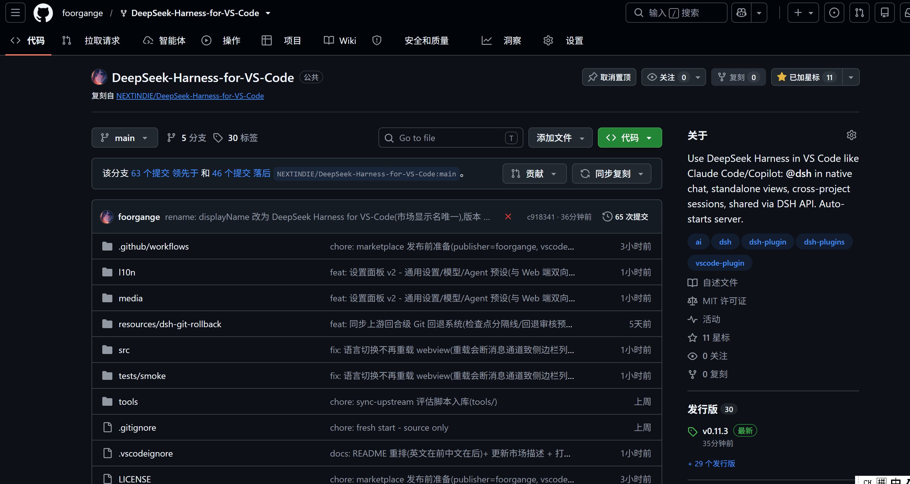
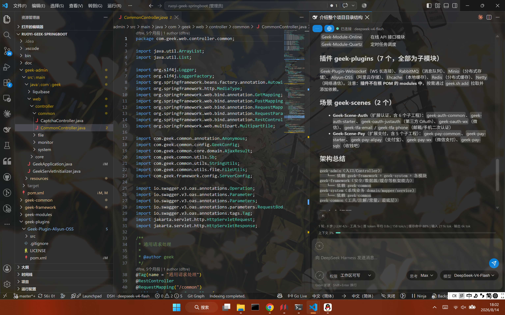
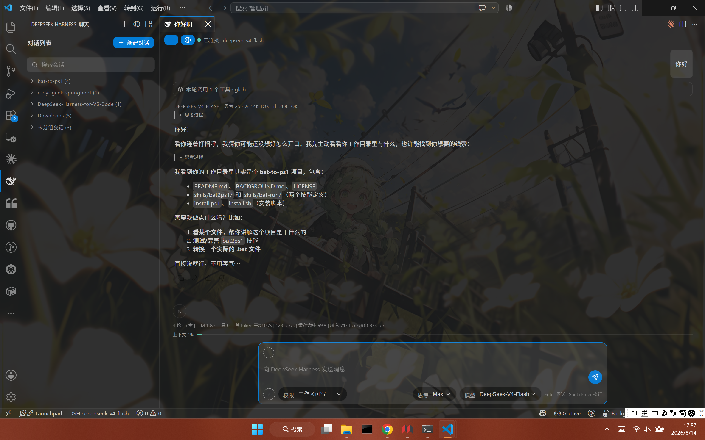
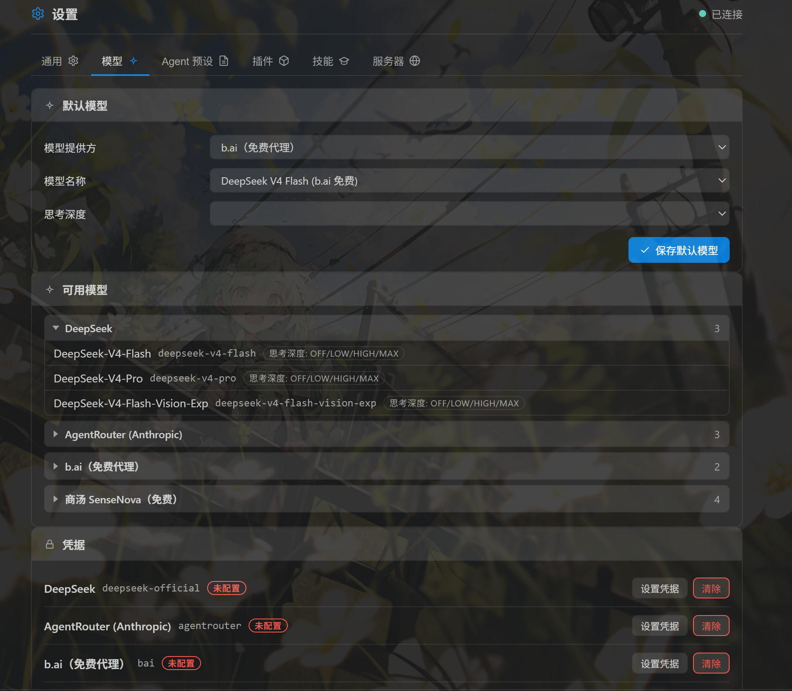
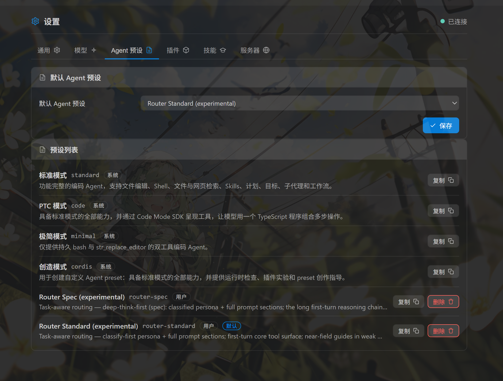
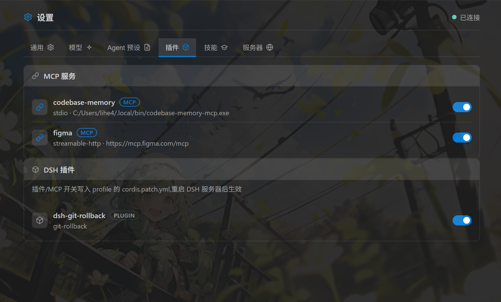
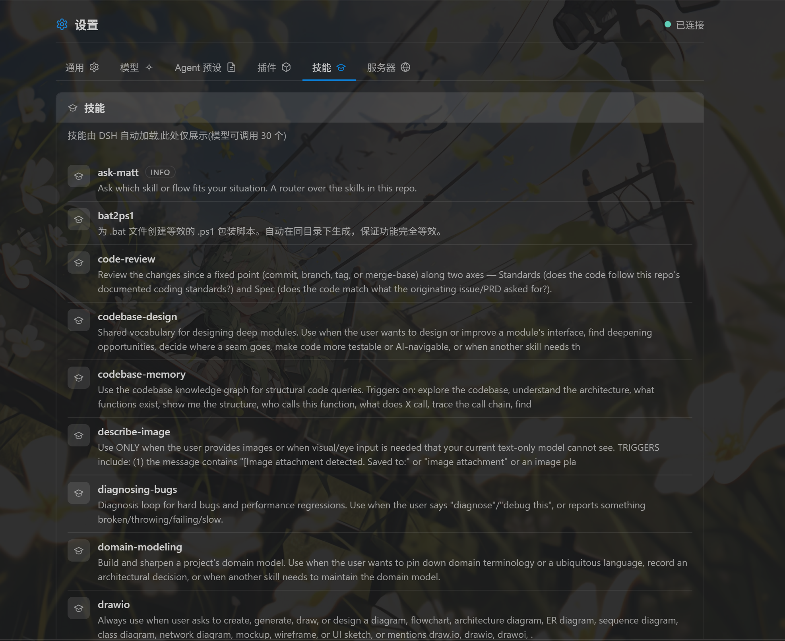
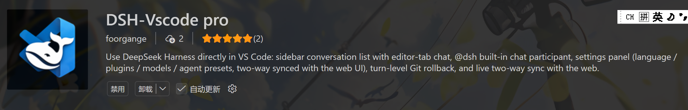

# 在vs code里使用deepseek harness:我做的插件又更新啦！

(补一下：原本用的名字和黑鲸鱼svg图标确实太容易和其他插件搞混导致很难找，所以换成新的比较有差异化的了)

再来宣传一下自己的在vscode里使用deepseek harness的插件，ds发布的第二天我就开始用了，一开始是fork了一个上游的dsh-vsc的仓库，但是上游那个仓库做的很拉，一堆bug，而且还有一堆经典ai写前端很喜欢的好丑的emoji，我就做了很多修改，还提了pr，但是上游一直不合我的pr我也不知道为啥（甚至后续他自己更新修的一些bug就是我之前已经提的pr），索性我就自己在这个分支上继续加新东西优化体验了。最开始在小黑盒宣传了一下（上篇帖子），但是因为下载不方便，构建的发行版只有几十下载量（我原来的上游因为在vs插件市场上的早，已经1k下载了）。

主要原因是我一直过不去微软云的人机验证，今天终于过了，有感兴趣的可以试一试。dsh在vsc里面用比起网页和gui对于开发还是比较方便的，能同时使用vs里面其他的好用插件，不用频繁切ide/网页。

（ps:虽然最开始是fork的上游仓库，但是到现在两个仓库已经有100多个提交不一样了，所以可以完全看作两个体验不一样的插件）

建立新会话时，如果不指定，插件会默认把当前vs code打开的项目文件当中工作区，当然，也可以手动指定工作区。

这部分布局主要参考的claude code for vs code插件,之前dsh出之前我都是用这个。

顺带一提，b.ai的免费dsf虽然上下文短了点，但是做一些小任务还是很好用的，尤其是ds涨价这麽多的情况下。

后两个预设是装的风神插件产生的，真的很好用。

然后设置里的这些内容主要是为了可视化使用起来更方便吧。

感兴趣的话可以下载使用看看！
