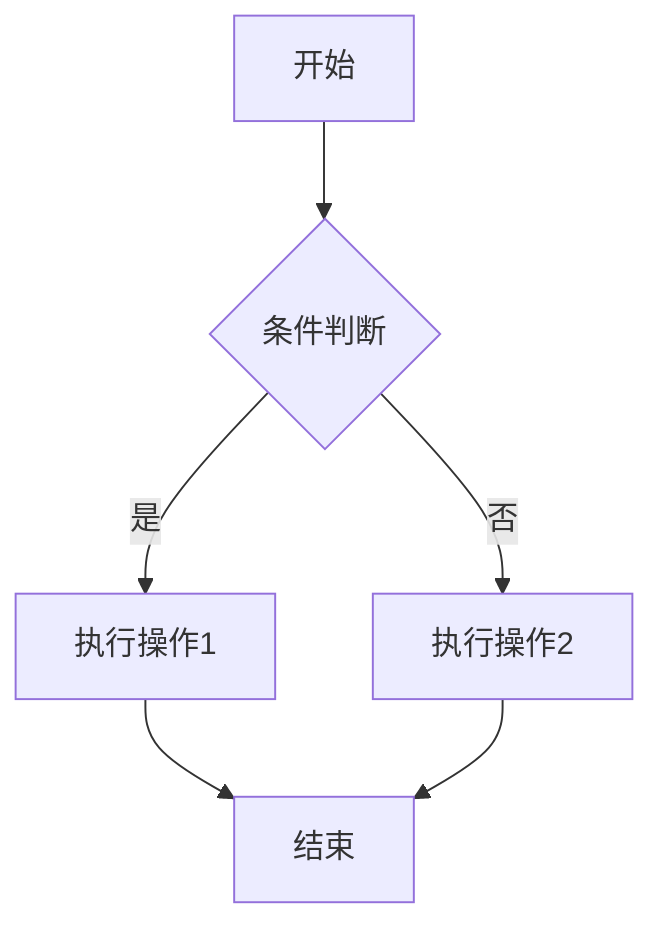
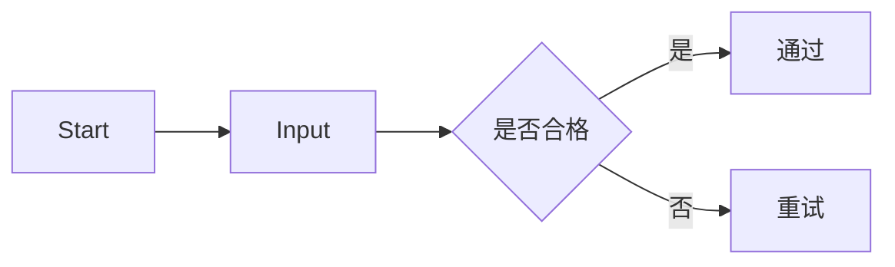
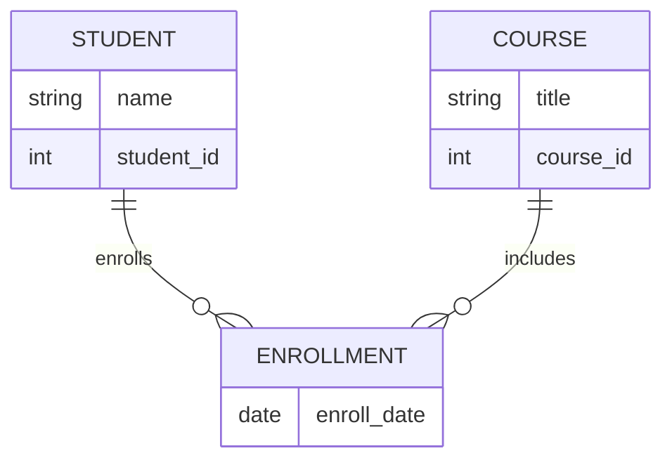

# 快速使用 Mermaid 语法在 draw.io 中绘制流程图与 ER 图


在做系统设计、编写文档或者教学展示时，我们常常需要制作流程图、ER 图等图示工具。而传统方式如手动拖拽不仅效率低，还难以维护。幸运的是，我们可以使用 **Mermaid 语法**配合 **draw.io**，快速生成这些图形，做到“用代码画图”，既高效又美观！

本文将教你如何快速上手：在 draw.io 中使用 Mermaid 语法创建流程图和 ER 图。

---

## 什么是 Mermaid？

[Mermaid]() 是一个基于文本的图形绘制工具，支持流程图、时序图、甘特图、ER 图等多种类型，语法简洁，适合开发者和技术写作者使用。

示例流程图语法如下：

graph TD  
  A[开始] --> B{条件判断}  
  B -- 是 --> C[执行操作1]  
  B -- 否 --> D[执行操作2]  
  C --> E[结束]  
  D --> E



---

## 为什么用 Mermaid + draw.io？

虽然 Mermaid 有自己的在线编辑器（如 [Mermaid Live Editor](https://mermaid.live)), 但它功能有限。而 draw.io 是功能强大的图形工具，支持丰富的导出格式和本地保存，还可以与 Mermaid 语法无缝结合，达到“代码生成图 + 图形手动优化”的完美结合。

---

## 如何在 draw.io 中导入 Mermaid 语法

### 一：访问支持 Mermaid 的 draw.io 编辑器

draw.io 的官方站点已经支持导入 Mermaid，访问：

 [https://app.diagrams.net/]()

> 建议使用 Chrome 浏览器，体验更稳定。

---

### 二：新建空白图表

1. 打开网站，创建一个本地保存图。
2. 进入编辑页面后，点击顶部菜单栏的：

    ```
    + > Mermaid
    ```

---

### 三：粘贴 Mermaid 代码

弹出的 Mermaid 输入窗口中粘贴你的 Mermaid 代码，比如一个简单的流程图：

graph LR  
  Start --> Input  
  Input --> Decision{是否合格}  
  Decision -- 是 --> Pass[通过]  
  Decision -- 否 --> Fail[重试]



点击 **Insert**，即可自动渲染为流程图！

---

## ER 图示例（实体关系图）

Mermaid 也支持简洁的 ER 图语法（beta 特性），如下示例：  
erDiagram  
  STUDENT ||--o{ ENROLLMENT : enrolls  
  COURSE ||--o{ ENROLLMENT : includes  
  STUDENT {  
    string name  
    int student_id  
  }  
  COURSE {  
    string title  
    int course_id  
  }  
  ENROLLMENT {  
    date enroll_date  
  }



操作一样，粘贴上述代码后点击 **Insert** 即可。

---

### 问题:我不会Mermaid语法怎么办?

### 回答:将你的需求描述给ai大模型,让它直接给你生成就好啦!
