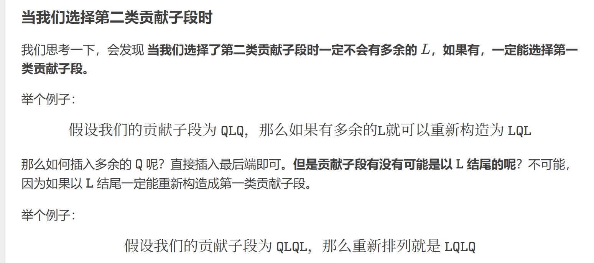

# 2025 蓝桥杯国B 部分题解

# P12836 [蓝桥杯 2025 国 B] 翻倍

## 题目描述

给定 $n$ 个正整数 $A_1, A_2, \ldots, A_n$，每次操作可以选择任意一个数翻倍。

请输出让序列单调不下降，也就是每个数都不小于上一个数，最少需要操作多少次？

## 输入格式

输入的第一行包含一个正整数 $n$。

第二行包含 $n$ 个正整数 $A_1, A_2, \ldots, A_n$。

## 输出格式

输出一个整数表示需要的最小操作次数。

## 输入输出样例 #1

### 输入 #1

```
6
4 3 2 1 7 9
```

### 输出 #1

```
8
```

## 说明/提示

 **【样例说明】**

可以将序列变为: $4, 6, 8, 8, 14, 18$，总计需要 $0 + 1 + 2 + 3 + 1 + 1 = 8$ 次操作。

 **【评测用例规模与约定】**

对于 20% 的评测用例，$n \leq 10, A_i \leq 100$。

对于 50% 的评测用例，$n \leq 5000, A_i < 2^{32}$，保证存在操作可以在所有 $A_i$ 小于 $2^{32}$ 的情况下满足题目要求。

对于 100% 的评测用例，$1 \leq n \leq 2 \times 10^5, 1 \leq A_i < 2^{32}$。

# 题解：

很容易想到直接暴力模拟，但是会因为超时导致只能过部分样例，看暴力模拟逻辑，我们遍历一遍数组是不可避免的，导致耗时的“翻倍这个操作”，可以想到，如果一个数本身很小，为了满足题意就会进行多次翻倍，耗费时间，但是如果我们把这个“多次翻倍”的多次操作优化到一次操作，那么复杂度将会来到O(n)而不是O(nm).

设某次翻倍操作次数为m, 即a[i-1] * 2的m次方等于a[i],则m为 `ceil(log2(A[i-1]/A[i]))`​。用sum来存每次操作次数即可。

```c++
#include <bits/stdc++.h>
using namespace std;
#define ll long long
ll a[200005];
int main(){
	cin.tie(0);
	cout.tie(0);
	ios::sync_with_stdio(0); 
	ll n,ans = 0;
	ll sum = 0;
	cin>>n;
	for(int i = 1;i<=n;i++)cin>>a[i];
	for(int i = 2;i<=n;i++){
		sum += ceil(log2(1.0*a[i-1]/a[i]));
		if(sum<0){
			sum = 0;
		}
		ans+= sum;
		
	}
	cout<<ans;
	
	return 0;
}

```

# P12831 [蓝桥杯 2025 国 B] 互质藏卡

## 题目描述

小蓝整理着阁楼上的旧物，偶然发现了一个落满灰尘的卡片箱。打开箱子，里面整齐地摆放着 17600 张卡片，每张卡片上都写有一个数字，恰好包含了从 1 到 17600 的所有正整数。

儿时的他热衷于收集各种卡牌，数量之多令人咋舌。如今，再次翻阅这些尘封的记忆，小蓝不禁感慨万千。他想起收藏家前辈的箴言：“收藏的魅力在于精粹，而非数量”。于是，他决定从这些卡牌中选取 $2025$ 张，组成一套“互质藏卡”。

“互质藏卡”的特点在于：任意两张卡片上的数字之间互质，即它们的最大公约数恒为 $1$。现在，请你帮小蓝计算，共有多少种不同的选取方案，使得选出的 $2025$ 张卡片满足“互质藏卡”的条件。由于答案可能很大，你只需给出其对 $10^9 + 7$ 取余后的结果即可。

注意：两个选取方案被认为是不同的，当且仅当它们所包含的数字集合不完全相同。即，若存在至少一个数字出现在其中一个集合但不出现在另一个集合中，则这两个方案被视为不同。

## 输入格式

无

## 输出格式

这是一道结果填空的题，你只需要算出结果后提交即可。本题的结果为一个整数，在提交答案时只填写这个整数，填写多余的内容将无法得分。

‍

# 题解

我们打表会发现1-17600只有2024个质数，这些数我们保证两两互质，在加上非质数但是和任何数都互质的1，刚好构成一个2025个数字的集合。同时我们知道：给你m个质数，这些数都是互质，同时可以得出是质数的**正整数**次方得到的数替换这个质数构成的集合也是都互质。

又这个质数的正整数次方不能大于17600,

根据组合数步步相乘，答案就是每个素数的次方数相乘。接下来继续枚举：

2最大有14次方，3为8次方，5为6次方，7为5次方，11为4次方。

13，17，19，23都取三次方。  
29 到 131 都取平方，共 23 个。  
剩余的素数都取一次方，对答案没有影响。  
所以最终答案为

14×8×6×5×4×34×223\=9132174213120将 9132174213120 对 109+7 取余，得到`174149196`​。

```c++
#include <bits/stdc++.h>
using namespace std;

int main()
{
    cout<<174149196;
    return 0;
}

```

---

# P12830 [蓝桥杯 2025 国 B] 新型锁

## 题目描述

密码学家小蓝受邀参加国际密码学研讨会，为此他设计了一种新型锁，巧妙地融合了数学的严谨性与密码学的安全性。这把锁包含 2025 个连续的数字格，每个格子需填入一个正整数，从而形成一个长度为 2025 的序列 $\{a_1, a_2, \ldots, a_{2025}\}$，其中 $a_i$ 表示第 $i$ 个格子上的数字。

要想解锁，该序列需满足以下条件：任意两个相邻格子中的数字，其最小公倍数（LCM）均为 2025。即对于所有的 $i$（$1 \leq i \leq 2024$），需满足：

$$
\text{LCM}(a_i, a_{i+1}) = 2025
$$

现在，请你计算有多少个不同的序列能够解开这把锁。由于答案可能很大，你只需输出其对 $10^9 + 7$ 取余后的结果即可。

## 输入格式

无

## 输出格式

这是一道结果填空的题，你只需要算出结果后提交即可。本题的结果为一个整数，在提交答案时只填写这个整数，填写多余的内容将无法得分。

---

这里直接引用洛谷大佬Sunrise_up的题解。


```c++
#include<bits/stdc++.h>
using namespace std;
int main(){
	ios::sync_with_stdio(0),cin.tie(0),cout.tie(0);
	cout<<385787853;
	return 0;
}

```

---

# P12832 [蓝桥杯 2025 国 B] 数字轮盘

## 题目描述

“数字轮盘”是一款益智游戏，基于一个带有指针的圆形轮盘展开。轮盘边缘按顺时针刻有数字 1 至 $N$，初始时指针指向 1。

游戏分为两阶段：旋转轮盘和恢复轮盘。

第一阶段，将轮盘顺时针旋转 $K$ 次。每次旋转，数字依次后移一位，指针指向的数字随之改变。例如，对于 $N = 4$ 的轮盘，初始状态为 1, 2, 3, 4（指针指向 1），旋转一次变为 4, 1, 2, 3（指针指向 4），再旋转一次变为 3, 4, 1, 2（指针指向 3），依此类推。

第二阶段，小蓝需通过操作恢复初始状态，每次操作包含以下两步：

- 第一步：翻转以指针为起点、顺时针方向的前 $N - 1$ 个数字的顺序。
- 第二步：翻转除指针外的 $N - 1$ 个数字的顺序。

例如，对 $N = 4$，状态为 4, 1, 2, 3（指针指向 4）进行一次操作：

- 第一步：翻转 4, 1, 2，变为 2, 1, 4, 3（指针指向 2）。
- 第二步：翻转 1, 4, 3，变为 2, 3, 4, 1（指针指向 2）。

现在，给定轮盘的数字个数 $N$ 和旋转次数 $K$，请计算小蓝最少需要几次操作才能恢复初始状态。如果无法恢复初始状态，则输出 -1。

## 输入格式

输入的第一行包含一个整数 $T$，表示测试用例的数量。

接下来 $T$ 行，每行包含两个整数 $N$ 和 $K$，分别表示轮盘上的数字个数和旋转次数。

## 输出格式

输出共 $T$ 行，每行包含一个整数，表示最少需要的操作次数。如果无法恢复初始状态，则输出 $-1$。

## 输入输出样例 #1

### 输入 #1

```
2
3 2
4 1
```

### 输出 #1

```
2
-1
```

## 说明/提示

 **【评测用例规模与约定】**

对于 30% 的评测用例，$1 \leq T \leq 10^2$，$2 \leq N \leq 500$，$0 \leq K \leq 500$。

对于 100% 的评测用例，$1 \leq T \leq 10^5$，$2 \leq N \leq 10^9$，$0 \leq K \leq 10^9$。

# 题解：

我们旋转K次，然后通过  ？次操作还原轮盘，模拟几次可以发现，一次操作其实就是将轮盘翻转了两次，于是问题就转化为：给出 n 和 k，每次将 k 加 2，求最少要多少次使 k 变为 n 的倍数，若无法实现，输出 −1。  
显然，如果 k 和 n 或 k 和 2n 的差值为偶数， 那就一定可以做到，至于为什么不考虑3n,4n和更多，因为3n和n 是等效的，4n 和 2n 是等效的。比如无论n是多少，3n-n = 2n,这个2n一定是偶数，那就不用考虑了，同理其它的也是一样的。

```c++
#include<bits/stdc++.h> 

using namespace std;
#define ll long long

int main( )
{	
    ios::sync_with_stdio(0);
	cin.tie(0);
	
	int T,n,k;
	cin>>T;
	while(T--){
		cin>>n>>k;
		k = k%n;
		if(k==0)cout<<0<<endl;
		else if((n-k)%2==0) cout<<(n-k)/2<<endl;
		else if((n-k+n)%2==0)cout<<(n-k+n)/2<<endl;
		else cout<<-1<<"\n";
		
	}
    
    
    return 0;
}
```

---

# P12838 [蓝桥杯 2025 国 B] 子串去重

## 题目描述

给定一个字符串 $S$ 以及若干组询问，每个询问包含两个区间 $(L_a, R_a)$, $(L_b, R_b)$，你需要判定 $S_{L_a}, S_{L_a+1}, \ldots, S_{R_a}$ 与 $S_{L_b}, S_{L_b+1}, \ldots, S_{R_b}$ 去重后有多少个位置上的字符是不同的。

这里的去重指的是每个子串对于每种字符，只保留第一个出现的那个，后续出现的直接丢弃。

例如 $\tt{aabcbac}$ 在选中区间 $[1,5]$ 时，得到子串 $\tt{aabcb}$，去重后为 $\tt{abc}$，选中区间 $[3,6]$ 时得到 $\tt{bcba}$，去重后为 $\tt{bca}$。

特别地，两个长度不同的子串中，较长串的多出的部分每个位置都视为不同。

## 输入格式

输入第一行包含一个字符串 $S$。

第二行包含一个整数 $m$，表示询问次数。

接下来 $m$ 行，每行包含四个整数，表示一次询问。

## 输出格式

输出共 $m$ 行，每行一个整数对应每次询问的答案。

## 输入输出样例 #1

### 输入 #1

```
aabcbabacdab
3
1 1 2 2
1 10 6 9
4 7 9 12
```

### 输出 #1

```
0
1
2
```

## 说明/提示

 **【评测用例规模与约定】**

对于 40% 的评测用例，$|S| \leq 10$, $m = 1$。

对于 60% 的评测用例，$|S|, m \leq 5000$。

对于 100% 的评测用例，$1 \leq |S|, m \leq 10^5$, $1 \leq L_a \leq R_a \leq |S|$, $1 \leq L_b \leq R_b \leq |S|$。

‍

# 题解：

注意到，字符串去重后的长度是不超过 26 的，那如果我们能得到两个区间的子串去重后的字符串，我们是可以直接暴力匹配算出的。那么问题就在于如何得到这两个去重后的字符串。

在本题中，去重定义为“每个子串对于每种字符，只保留第一个出现的那个，后续出现的不要”。也就是可以转化成**对于每一个字符，如果其在区间内存在，寻找其在区间内第一次出现的位置，按照下标排序输出即可.**

当然不能线性扫描，我们可以先预处理每个字母在字符串出现的所有下标位置，可以看出下标是单调递增的，那就可以采用二分查找。

## 补充知识：

#### lower\_bound/upper\_bound（二分）

1. 原理：二分
2. 数组：a[1\~n];
3. lower\_bound(a+1,a+n+1,x):从数组1\~n查找第一个大于等于x的数，返回该数的地址，不存在的话返回n+1,然后减去起始地址a，得到下标。

```cpp
for(int i=1;i<=n;i++) cin>>a[i];
int x;
cin>>x;
cout<<lower_bound(a+1,a+1+n,x)-a<<endl;  返回x的数组下标（此数组从1开始存）


//如果从0开始存，那就是：
for (int i = 0; i < n; i++) cin >> a[i];
int x;
cin >> x;
cout << lower_bound(a, a + n, x) - a << endl;

//如果是用vector从0开始存，那就是：

vector<int> a(n);
for (int i = 0; i < n; i++) cin >> a[i];
int x;
cin >> x;

auto it = lower_bound(a.begin(), a.end(), x);
cout << (it - a.begin()) << endl;  // 输出0-based下标

//如果是用vector从1开始存，那就是：

vector<int> a(n + 1);  // 多开一个位置，a[1] 到 a[n] 用
for (int i = 1; i <= n; i++) cin >> a[i];
int x;
cin >> x;

auto it = lower_bound(a.begin() + 1, a.begin() + 1 + n, x);  //务必注意
cout << (it - a.begin()) << endl;  // 输出的是1-based下标

-------------------------------------------------------------------------------------------------------------------

//如果想要查找降序数组
cout<<lower_bound(a+1,a+n+1,x,greater<int>())-a<<endl;  //在 降序排序的数组 a[1..n] 中，找第一个 小于等于 x（按降序的定义） 的元素位置。
```

1. upper\_bound(a+1,a+n+1,x):从数组1\~n查找第一个大于x的数，返回该数的地址，不存在的话返回n+1,然后减去起始地址a，得到下标。

```cpp
for(int i=1;i<=n;i++) cin>>a[i];
int x;
cin>>x;
cout<<upper_bound(1,n,x)-a<<endl;

//如果想要查找降序数组
cout<<upper_bound(a+1,a+n+1,x,greater<int>())-a<<endl;
```

## vector注意

​`vector<int> pos[26]`​（这是二维的）

- **含义**：一个**长度为 26 的数组**，数组的每个元素是一个 `vector<int>`​。
- **作用**：你相当于有 26 个独立的 `vector<int>`​，可以用 `pos[0]`​、`pos[1]`​ …… `pos[25]`​ 分别访问

  对于pos[i][p],

- ​`pos[i]`​ 取出来是一个 `vector<int>`​
- ​`[p]`​ 取的是这个 `vector<int>`​ 的第 `p`​ 个元素
- 注意这样构造出的26个vector的长度初始都是0.

而vector\<int\> pos（26）则是普通的一维的。

## AC代码：

```c++
#include <bits/stdc++.h>
using namespace std;

int q;
string s;
vector<int> pos[26];

vector<pair<int,char>> get(int l, int r) {
    vector<pair<int,char>> res;
    for (int i = 0; i < 26; i++) {
        int p = (int)(lower_bound(pos[i].begin(), pos[i].end(), l) - pos[i].begin());
        if (p == (int)pos[i].size()) continue;  //到end也没找到
        int idx = pos[i][p];
        if (idx > r) continue;
        res.push_back({idx, (char)(i + 'a')});
    }
    sort(res.begin(), res.end());
    return res;
}

int main() {
    ios::sync_with_stdio(false);
    cin.tie(nullptr);

    cin >> s >> q;
    for (int i = 0; i < (int)s.size(); i++)
        pos[s[i] - 'a'].push_back(i + 1);  //注意第一次push_back的元素是放到了pos[i][0]的位置，影响着我们lower_bound的使用

    while (q--) {
        int l1, r1, l2, r2;
        cin >> l1 >> r1 >> l2 >> r2;

        auto v1 = get(l1, r1);
        auto v2 = get(l2, r2);

        int diff = abs((int)v1.size() - (int)v2.size());
        int n = min((int)v1.size(), (int)v2.size());
        for (int i = 0; i < n; i++)
            if (v1[i].second != v2[i].second) diff++;

        cout << diff << "\n";
    }

    return 0;
}

```

---

# P12834 [蓝桥杯 2025 国 B] 项链排列

## 题目描述

小蓝有 $A$ 颗蓝珠（用字符 'L' 表示）和 $B$ 颗桥珠（用字符 'Q' 表示），他打算用这些珠子串成一条项链。他认为项链的美感主要体现在其视觉“变化”上：当项链中任意两个相邻的珠子种类不同时，就记为产生了一次“变化”。

为了系统地研究不同排列的美感，小蓝将每一种项链的排列方式表示为一个长度为 $A + B$ 的字符串。这个字符串由 $A$ 个字符 'L' 和 $B$ 个字符 'Q' 组成。相应地，一条项链的“变化次数”即为这个字符串中，所有相邻且不相同的字符对的数目。

例如，如果项链的排列是“LLQLQ”，那么：

- 第 1 个 'L' 和第 2 个 'L' 相同，无变化。
- 第 2 个 'L' 和第 3 个 'Q' 不同，产生了 1 次变化。
- 第 3 个 'Q' 和第 4 个 'L' 不同，产生了 1 次变化。
- 第 4 个 'L' 和第 5 个 'Q' 不同，产生了 1 次变化。

排列“LLQLQ”的总“变化次数”为 3。

现在，小蓝希望找到一种项链排列，使其总“变化次数”恰好为 $C$。对此，请你帮他在所有满足这一条件的排列中，找出字典序最小的那一个。如果不存在任何满足条件的排列方式，则输出 -1。

## 输入格式

输入仅一行，包含三个整数 $A，B$ 和 $C$，分别表示蓝珠数量、桥珠数量和目标变化次数。

## 输出格式

输出一个长度为 $A + B$ 的字符串，表示字典序最小的满足条件的排列。如果不存在这样的排列，则输出 $-1$。

## 输入输出样例 #1

### 输入 #1

```
2 2 2
```

### 输出 #1

```
LQQL
```

## 输入输出样例 #2

### 输入 #2

```
2 2 3
```

### 输出 #2

```
LQLQ
```

## 输入输出样例 #3

### 输入 #3

```
2 2 4
```

### 输出 #3

```
-1
```

## 说明/提示

 **【评测用例规模与约定】**

对于 20% 的评测用例，$0 \leq A, B, C \leq 100$，$1 \leq A + B \leq 200$。

对于 100% 的评测用例，$0 \leq A, B, C \leq 10^6$，$1 \leq A + B \leq 2 \times 10^6$。

# 题解

把字符串按相同字符连续段分块（每个块内字符都相同）。比如 `LLQQLLQ`​ 分块为 `LL | QQ | LL | Q`​，块数 \= 4。变化次数恰好等于块数 - 1（因为每两个相邻块之间都有一次“变化”）。  
块必然交替出现：要么 `L Q L Q ...`​（以 L 开头），要么 `Q L Q L ...`​（以 Q 开头）。因此：

- 如果以 `L`​ 开头，`L`​ 块数 \= `ceil(m/2)`​，`Q`​ 块数 \= `floor(m/2)`​。
- 如果以 `Q`​ 开头，`Q`​ 块数 \= `ceil(m/2)`​，`L`​ 块数 \= `floor(m/2)`​。

  
每个块至少要有 1 个珠子，因此：

- 若要以 `L`​ 开头，则必须 `A >= Lneed && B >= Qneed`​；
- 若以 `Q`​ 开头，则必须 `A >= Qneed && B >= Lneed`​（即把上面两个数互换）；
- 特殊地，若 `C == 0`​，则必须整个串都是同一种珠子（即 `A==0`​ 或 `B==0`​），否则无法得到 0 次变化。

    
  字典序中 `'L'`​ 比 `'Q'`​ 小，所以尽可能让前面的字符为 `L`​。

- 如果可以以 `L`​ 开头，就选择“以 L 开头”的构造；

  - 在满足块数的前提下，把多余的 `L`​（即 `A - Lneed`​）**全部放到最前面**，这样前缀尽可能多的 `L`​，字符串更小；
  - 然后按块交替放（每块至少 1 个字符），最后把多余的 `Q`​ 放在合适位置（代码里根据块数奇偶决定放在中间还是末尾）以用尽全部珠子并保证块结构。
- 若不能以 `L`​ 开头，则看能否以 `Q`​ 开头（把需要的块数互换再判断），然后构造“以 Q 开头”的、在该约束下的字典序最小的串（既然首字母必须是 Q，后面尽量早放 L）。

但是当我们选择贡献第二类子段时，有些操作是不用做的（下图引用自洛谷用户smirk的题解）  
​

```c++
#include <bits/stdc++.h>
using namespace std;
typedef long long ll;
const int N = 1e5 + 7;
int a, b, c;
int main() {
    ios::sync_with_stdio(0);
    cin.tie(0), cout.tie(0);
    cin >> a >> b >> c;
    if (!c) {
        if (a != 0 && b != 0) {
            cout << "-1";
        } else {
            for (int i = 1; i <= a; i++) cout << "L";
            for (int i = 1; i <= b; i++) cout << "Q";
        }
        return 0;
    }
    int Lneed = c / 2 + 1;
    int Qneed = (c + 1) / 2;
    if (a >= Lneed && b >= Qneed) {
        for (int i = 1; i <= a - Lneed; i++) cout << "L";
        for (int i = 1; i <= Lneed + Qneed - 1; i++) {
            if (i & 1)
                cout << "L";
            else
                cout << "Q";
        }
        if ((Lneed + Qneed) & 1) {
            for (int i = 1; i <= b - Qneed; i++) cout << "Q";
            cout << "L";
        } else {
            cout << "Q";
            for (int i = 1; i <= b - Qneed; i++) cout << "Q";
        }
    } else {
        swap(Lneed, Qneed);
        if (a < Lneed || b < Qneed) {
            cout << "-1";
            return 0;
        }
        for (int i = 1; i <= Qneed + Lneed; i++) {
            if (i & 1)
                cout << "Q";
            else
                cout << "L";
        }
        for (int i = 1; i <= b - Qneed; i++) cout << "Q";
    }
    return 0;
}

```

---

‍
