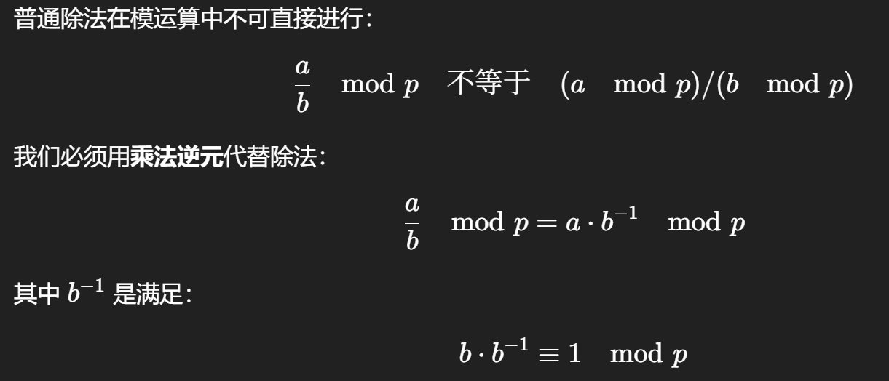
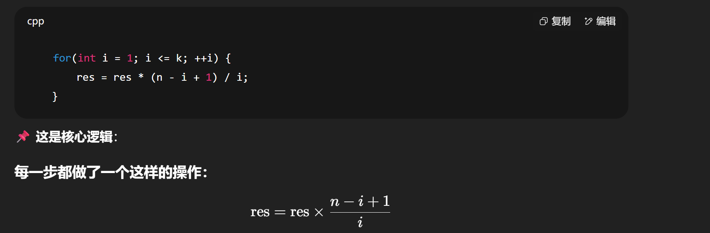

# 暑期集训

## 杂项

1. |​`trunc(x)`​|
    | ----|

    |截断小数部分|
    | ------------|

    |​`trunc(-2.3)`​|
    | ----|

    |​`-2.0（结果）`​|
    | ----|

2. 遇到某类题目，类似背包 dp 优化思想，若这个题目我们关注的这个条件变量，在一个 0 到 i 的总循环次数中，我们只需要记录第 k 次和第 k-1 次的话，那就不需要开一个全局数组，用一个变量记录就行，节约了空间和每次清空数组的时间。同时注意如果是一个线性的条件，每遇到 xx 条件我们进行一次操作，一定要注意最后走到线性的终点，那个终点本身算不算一次 xx 条件，需要我们在走完整个线性再记录一次。

‍

3. sort 函数注意不要排多余位置，不然多余位置如果是 0，你从小到大排，不跑前面去了吗。
4. a.resize(n + 1); // 方便从 a[1] 开始，忽略 a[0]  
    ​`resize(n + 1)`​：将 `a`​ 的长度调整为 `n+1`​。

    dp0.assign(n + 1, 0);  
    语法含义：  
    assign(length, value) 是 vector 的用法之一，表示：

    把这个 vector 清空；

    然后变成长度为 n+1，所有值为 0 的数组。

每次调用 `assign`​ 或 `resize`​，时间复杂度是 **O(n)**

‍

5. If情况很多时，可以用这种写法：

    bool ok_cur  = (a[i] == 1 || a[i] == -1);  
    bool ok_prev = (a[i-1] == 0 || a[i-1] == -1);

    ```cpp
    逐行解释：

    a[i] == 1 || -1：当前位置必须能是阳光

    a[i-1] == 0 || -1：前一个位置必须能是月光

    也就是说，这对 (i-1, i) 必须形如 0 1、-1 1、0 -1、-1 -1
    ```

‍

6. 不要忘了使用unsigned long long；

7. m = 1 - m;  
    如果 m == 0，变成 1

    如果 m == 1，变成 0

或者 m ^= 1;

8. 2LL而不是2，相乘时经常注意。
9. **1 和任何非 1 的正整数都是互质的**。

10. 给你m个质数，这些数都是互质，同时可以得出是质数的**正整数**次方得到的数替换这个质数构成的集合也是都互质。

11.

12. ‍

‍

---

### <span data-type="text" style="color: var(--b3-font-color8);">判断一个数是不是 2 的某次方</span>

```cpp
#include <cmath>
bool isPowerOfTwo(int n) {
    if (n <= 0) return false;
    double x = log2(n);
    return floor(x) == x;
}

```

或使用位运算：

```cpp
bool isPowerOfTwo(int n) {
    return n > 0 && (n & (n - 1)) == 0;
}
```

‍

### 预处理所有 2 的幂次

```cpp
    const int MAXN = 500000;
    static int pow2[MAXN+1];
    pow2[0] = 1;
    for(int i=1; i<=MAXN; ++i)
        pow2[i] = (pow2[i-1] << 1) % MOD;
```

重点解释：

- ​`pow2[i]`​ 表示 $2^i \mod MOD$
- ​`<<1`​ 是 **左移一位**，等于乘以 2（即 $2^i = 2^{i-1} × 2$）
- 为什么预处理？因为我们频繁要用 $2^k$ 的值（表示 `-1`​ 有多少种替换方式）

‍

# 位运算知识补充

异或：**相同为 0，不同为 1**。

```python
(a >> k) & 1

意思是：取出第 k 位是 0 还是 1（从第0位开始算）

---------------------------------------------------
例子：
a = 13 // 二进制 1101
a >> 2 = 11 = 0011  （右移 2 位）
(a >> 2) & 1 = 1    // 看第2位是否是1

```

按位计算常见操作：

```python
const int max_bit = 31;  // int 最大支持到第31位（0~31），因为题中 A[i] <= 1e8（约位2的31次方）
# 我们打算每一位一位来计算对最终答案的贡献。

for (int k = 0; k <= max_bit; k++) {
#我们要处理每一位 k（第 0 位~第 31 位），问这一位对所有异或结果的总贡献是多少。
```

---

核心操作代码详解：

```cpp
long long M = (1LL << (k + 1)) - 1;
```

它的作用是构造一个**掩码 M**，这个 M 是一个**仅低** **​`k+1`​**​ **位为 1，其他高位全部为 0**的数。这个掩码之后会被用于：

```cpp
unsigned int x = a[i] & M;
```

以便把 `a[i]`​ 的**低** **​`k+1`​**​ **位（0~k位）** 保留下来，高位清零。

---

## 一、首先什么是 `1LL << (k+1)`​？

### 左移运算 `<<`​ 的意思是：

把一个数往左移动若干位，相当于**乘以 2 的若干次方**。

### 举个例子：

```cpp
1 << 3 = 8    // 因为 2^3 = 8
```

所以：

```cpp
1LL << (k + 1) 就是 2^(k+1)
```

但结果是个二进制形式，比如：

- ​`k = 2`​，那么 `1LL << 3 = 8`​ → 二进制是 `00001000`​

---

## 二、减去 1 会发生什么？

### 举个例子：

```
1LL << 3 = 8  ->  二进制 00001000
8 - 1 = 7     ->  二进制 00000111
```

也就是：**低3位变成了全是1，高位是0**

### 所以结论是：

```cpp
(1LL << (k + 1)) - 1
```

构造了一个数，它的二进制是：

- **低 k+1 位（0~k位）是 1**
- **高位是 0**

我们叫它“掩码 mask”，比如：

|k|表达式|值|二进制|
| -----| ---------------------------------| -----| ----------|
|0|(1LL \<\< 1) - 1 \= 1|1|00000001|
|1|(1LL \<\< 2) - 1 \= 3|3|00000011|
|2|(1LL \<\< 3) - 1 \= 7|7|00000111|
|3|(1LL \<\< 4) - 1 \= 15|15|00001111|
|...|...|...|...|

---

## 三、它的作用是什么？

有了这个 `M`​，我们就可以写：

```cpp
x = a[i] & M;
```

也就是：把 `a[i]`​ 的**低** **​`k+1`​**​ **位保留**，其余高位全部置为 0。

因为按位与 `&`​ 的规则是：

- 1 & x \= x
- 0 & x \= 0

例子：

```
a[i] = 10101101
M    = 00000111   （k=2，保留低3位）

x = a[i] & M = 00000101
```

最终只保留了 `a[i]`​ 的低 `k+1`​ 位。

---

## 四、为什么要这样做？

因为题目说：我们在判断这个“神秘异或”的时候，需要从**最低位往高位扫，统计1的个数是否为奇数**。

所以每次我们处理第 `k`​ 位时：

- 我们需要知道“从第 0 位到第 k 位”里有几个 1
- 只处理到第 k 位为止

→ 所以只保留前 `k+1`​ 位（从第 0 位到第 k 位），这正是 `a[i] & M`​ 的作用。

---

## 五、一句话总结

```cpp
long long M = (1LL << (k + 1)) - 1;
```

构造了一个掩码 `M`​，它的作用是：

> 保留 `a[i]`​ 的最低 `k+1`​ 位（第 0\~k 位），把高位全部清零，**以便只分析这部分位的信息**。

---

```python
int parity = __builtin_parity(x);
这个是 GCC 内置函数：

作用：返回 x 中 1 的个数的奇偶性

返回值是 1（奇数）或 0（偶数）

很多时候我们求第x位是第奇数个1还是第偶数个1，只需要求前x个位里有奇数个1还是偶数个1就行了，有奇数个1，那这一位不就是第奇数个1吗
```

记住：两个数异或后，1 的个数 = a 和 b 在该段的不同位个数，且如果只关注前0~k位，a的1个数是奇数，b的1个数是偶数，那么a和b异或后的c的1的个数是奇数，即c的第k位如果异或后是1，那一定是第奇数个1，同理a的1个数和b的1的个数都是奇数或者偶数，那c的1的个数就是偶数。

‍


```python
‍
#include <iostream>
#include <cstdio>
using namespace std;

const int N = 500000;
const long long MOD = 998244353;

long long a0[N + 5], a1[N + 5], a2[N + 5], a3[N + 5];
long long ans[N + 5];

int main() 
{
    a0[0] = 1;
    a1[0] = a2[0] = a3[0] = 0;

    for(int i = 1; i <= N; i++) 
    {
        a0[i] = i * a0[i - 1] % MOD;
        a1[i] = (a0[i - 1] + i * a1[i - 1]) % MOD;
        a2[i] = (2LL * a1[i - 1] + i * a2[i - 1]) % MOD;
        a3[i] = (3LL * a2[i - 1] + i * a3[i - 1]) % MOD;
        ans[i] = (a3[i] + 3LL * a2[i] + a1[i]) % MOD;
    }

    int T;
    cin >> T;
    while (T --) 
    {
        int n;
        cin >> n;
        cout << ans[n] << endl;
    }
    return 0;
}

```

‍

```python
a1[i] = ∑ 所有长度为 i 的排列 P 的 f(P)

如此题情况可当结论记，如果我们知道一堆f(P)的和,即a1[i],如果让我们求的是f(P)的和，那只需要输出a1[n]就可以了，但是如果是求一堆f(P)分别三次方再加起来求和的话，那就可以套这个题，即ans[n].

‍

a0[0] = 1;
a1[0] = a2[0] = a3[0] = 0;

for(int i = 1; i <= N; i++) 
    {
        a0[i] = i * a0[i - 1] % MOD;
        a1[i] = (a0[i - 1] + i * a1[i - 1]) % MOD;
        a2[i] = (2LL * a1[i - 1] + i * a2[i - 1]) % MOD;
        a3[i] = (3LL * a2[i - 1] + i * a3[i - 1]) % MOD;
        ans[i] = (a3[i] + 3LL * a2[i] + a1[i]) % MOD;
    }
‍
```

---

gcd函数（辗转相除法）

```python
ll gcdll(ll a, ll b) {
    while (b) {
        ll t = a % b;
        a = b;
        b = t;
    }
    return a;
}

```

---

**题目：** 给定一个正偶数 `n`​，你要从 `{1, 2, ..., n}`​ 中挑出 **恰好** **​`n/2`​**​ **个数**，组成一个子集 `S`​，要求满足：

对于 `S`​ 中任意三个数 `x, y, z`​（可以相等），它们的乘积 `x*y*z`​ **不能是一个完全平方数**。

‍

> 一个整数是完全平方数，当且仅当它的 ​**质因子次数都是偶数**​。

例如：

- 36 \= 2² × 3²（2 和 3 的次数都是偶数 → √）
- 45 \= 3² × 5¹（5 的指数是奇数 → ×）
- 60 \= 2² × 3¹ × 5¹（两个奇数指数 → ×）

  所以我们希望我们挑选的那些数，**它们的质因子指数“乘起来”不会全变成偶数。**

  换个角度说，如果我们选一些数，这些数的质因子个数是**奇数个**，那么任何三个相乘，它们乘积的质因子个数很可能是奇数总和（不是每个都变偶数），**就不会构成平方数**。
- ### 所以本题思路就变成了：

  > 挑出 `n/2`​ 个数，使得它们的**质因子个数是奇数**。
  >

  这种质因子个数叫做：**Ω(n)** ，表示 `n`​ 的所有质因子总个数（含重数）  
  例子：

  - 12 \= 2² × 3¹ → 有 3 个质因子 → Ω(12) \= 3
  - 18 \= 2¹ × 3² → Ω(18) \= 3
  - 30 \= 2¹ × 3¹ × 5¹ → Ω(30) \= 3

  而：

  - 6 \= 2¹ × 3¹ → Ω(6) \= 2（偶数） → 不选

---

## 线性筛法

```python
#include<iostream>
#include<algorithm>
#include<cstring>
#include<cstdio>
using namespace std;
const int N=1e6+10;

int primes[N],cnt;
bool st[N];//标记是否被筛过


int num[N];
// num[x] 表示 x 的质因子个数,在需要知道每个数它的质因子个数的时候的题目需要用到。

void get_primes(int n)
{
    for(int i=2;i<=n;i++)
    {
        if(!st[i]) {
		  primes[cnt++]=i;
		  num[i] = 1;  // prime 只有自己 → 质因子个数为 1
		}

        for(int j=0;primes[j]<=n/i;j++)/*从小到大枚举所有的质数，primes[j]*i<=n保证了要筛的合数
在n的范围内*/
        {
            st[primes[j]*i]=true;//每次把当前质数和i的乘积筛掉，也就是筛掉一个合数
			num[prime[j]*i]= num[i] + 1;
			
            if(i%primes[j]==0) break;//当这一语句执行，primes[j]一定是i的最小质因子
        }
    }
}

int main()
{
    int n;
    cin>>n;

    get_primes(n);

    cout<<cnt<<endl;

    return 0;
}
```

注意：primes数组是从下标0开始存的，primes[0]是第一个质数。

---

$$
{
\gcd\left(a^b, c^d\right) = \gcd(a, c)^{\min(b, d)}
}
$$

注意这个公式的前提是：  
**a 和 c 的所有公共质因子都在同一个次数下出现，即**：

- 如果 `a = g * a'`​，`c = g * c'`​ 且 `gcd(a', c') = 1`​，
- 那么才有：

  $$
  \gcd(a^b, c^d) = g^{\min(b, d)}
  $$

但是 **当** **​`a`​**​ **和** **​`c`​**​ **本身不是** **​`g * a'`​** ​ **和** **​`g * c'`​** ​ **的形式（即不能被公共质因子完全约去）时**，这个公式就会失效。

---

给出一通用的计算代码：

```python
#include <bits/stdc++.h> 
using namespace std;
#define ll long long
#define debug() cout << "_______________________" << endl

const ll mod = 998244353;

ll a, b, c, d;


ll qp(ll a, ll b, ll mod) {
    a %= mod;
    ll res = 1;
    while (b) {
        if (b & 1) {
            res = res * a % mod;
        }
        a = a * a % mod;
        b >>= 1;
    }
    return res;
}

int main() {
    ios::sync_with_stdio(0);
    cin.tie(0);

    ll T;
    cin >> T;
    while (T--) {
        cin >> a >> b >> c >> d;
        ll ans = 1;

        while (__gcd(a, c) != 1) {
            if (b < d) {
                swap(a, c);
                swap(b, d);
            }
            ll g = __gcd(a, c);
            ans = ans * qp(g, d, mod) % mod;


            a = g;  // 我们继续处理公共因子的幂次
            c /= g;    // 从 c 中移除公共因子
            b -= d;  //减掉公共幂
        }

        cout << ans << endl;
    }

    return 0;
}

```

可以看到核心逻辑为

```c++
ll ans = 1; //初始化答案，最终结果是多个公因子的乘积。

        while (__gcd(a, c) != 1) {   //只要 a 和 c 还有公共因子，就不断处理它。
            if (b < d) {
                swap(a, c);     
                swap(b, d);  //`c^d` 比 `a^b` 更强，那就交换过来，让 `a^b` 始终更大，方便我们减掉公共幂。
							//不可以只交换 b 和 d，因为 b 是 a 的幂，d 是 c 的幂。你不能让指数和底数“错配”。否则你就不再在计算 a^b 和 c^d 的 GCD 了。
            }
            ll g = __gcd(a, c);
            ans = ans * qp(g, d, mod) % mod;  //我们换完，d就是b和d里小的那个
            a = g;   //接下来对于剩下的幂（后面b减去d），我们来看g的贡献,因为g也有它的质因子，继续处理公共因子这个“核心底数”
            c /= g;  //剥离已经贡献的公共因子，准备下一轮处理
            b -= d;  //减掉用过的幂
        }

        cout << ans << endl;


```

---

# P12830 [蓝桥杯 2025 国 B] 新型锁（数位dp好题）

## 题目描述

密码学家小蓝受邀参加国际密码学研讨会，为此他设计了一种新型锁，巧妙地融合了数学的严谨性与密码学的安全性。这把锁包含 2025 个连续的数字格，每个格子需填入一个正整数，从而形成一个长度为 2025 的序列 $\{a_1, a_2, \ldots, a_{2025}\}$，其中 $a_i$ 表示第 $i$ 个格子上的数字。

要想解锁，该序列需满足以下条件：任意两个相邻格子中的数字，其最小公倍数（LCM）均为 2025。即对于所有的 $i$（$1 \leq i \leq 2024$），需满足：

$$
\text{LCM}(a_i, a_{i+1}) = 2025
$$

现在，请你计算有多少个不同的序列能够解开这把锁。由于答案可能很大，你只需输出其对 $10^9 + 7$ 取余后的结果即可。

## 输入格式

无

## 输出格式

这是一道结果填空的题，你只需要算出结果后提交即可。本题的结果为一个整数，在提交答案时只填写这个整数，填写多余的内容将无法得分。


---

# C(n,k)求法（需要模一个质数p时）

‍



‍

要算：

$$
C(n, k) = \frac{n!}{k!(n-k)!} \mod p
$$

这里的除法不能直接做，要改写为：

$$
C(n, k) = n! \cdot (k!)^{-1} \cdot ((n-k)!)^{-1} \mod p
$$

所以必须知道 $k!$ 和 $(n-k)!$ 的逆元。

‍

如何高效求逆元？

当模数 $p$ 是**质数**时，可以使用 **费马小定理**：

$$
a^{p-1} \equiv 1 \mod p \Rightarrow a^{p-2} \equiv a^{-1} \mod p
$$

所以我们可以用快速幂来求：

$$
a^{-1} = a^{p-2} \mod p
$$

---

### 先预处理阶乘数组 + 阶乘的逆元数组

```cpp
const int N = 1e6 + 10; // 看题目最大 n 设定
const int mod = 1e9 + 7;

long long fact[N], inv[N];

// 快速幂：a^b % mod
long long qpow(long long a, long long b) {
    long long res = 1;
    while(b) {
        if(b & 1) res = res * a % mod; // 如果当前位是1
        a = a * a % mod;               // a翻倍
        b >>= 1;
    }
    return res;
}

void init() {
    fact[0] = inv[0] = 1;
    for(int i = 1; i < N; ++i)
        fact[i] = fact[i-1] * i % mod;           // 预处理阶乘

    inv[N - 1] = qpow(fact[N - 1], mod - 2);     // 最后一个阶乘的逆元
    for(int i = N - 2; i >= 1; --i)
        inv[i] = inv[i + 1] * (i + 1) % mod;     // 利用递推预处理所有逆元
}
```

- ​`fact[i]`​ 表示 $i! \mod p$
- ​`inv[i]`​ 表示 $(i!)^{-1} \mod p$
- 利用了逆元的递推公式：

  $$
  \text{inv}[i] = \text{inv}[i+1] \cdot (i+1) \mod p
  $$

---

### 组合数查询函数

```cpp
long long C(int n, int k) {
    if(k > n || k < 0) return 0;
    return fact[n] * inv[k] % mod * inv[n - k] % mod;
}
```

#### 公式展开过程：

$$
C(n,k) = \frac{n!}{k!(n-k)!} \mod p = fact[n] \cdot inv[k] \cdot inv[n-k] \mod p
$$

---

### 举例

```cpp
int main() {
    init();
    cout << C(5, 2) << endl;  // 输出 10
    cout << C(1000000, 500000) << endl; // 秒出答案
    return 0;
}
```

---

### 时间复杂度

|操作|时间复杂度|
| ------------------| --------------|
|初始化`fact[]`​和`inv[]`​|$O(n + \log p)$一次性预处理|
|单次查询组合数`C(n, k)`​|$O(1)$常数时间查询|

---

当然，如果我们不需要对任何数取模，可以直接：

```c++
long long C(int n, int k) {
    if(k > n || k < 0) return 0;
    if(k > n - k) k = n - k; // 对称性优化
    long long res = 1;
    for(int i = 1; i <= k; ++i) {
        res = res * (n - i + 1) / i;
    }
    return res;
}

```

$C(n, k) = \frac{n \cdot (n - 1) \cdot \cdots \cdot (n - k + 1)}{k!} $  



对于核心逻辑这样一个for循环执行完，也就完成了我们原本想要的计算。

---

#### lower\_bound/upper\_bound（二分）

1. 原理：二分
2. 数组：a[1\~n];
3. lower\_bound(a+1,a+n+1,x):从数组1\~n查找第一个大于等于x的数，返回该数的地址，不存在的话返回n+1,然后减去起始地址a，得到下标。

```cpp
for(int i=1;i<=n;i++) cin>>a[i];
int x;
cin>>x;
cout<<lower_bound(a+1,a+1+n,x)-a<<endl;  返回x的数组下标（此数组从1开始存）


//如果从0开始存，那就是：
for (int i = 0; i < n; i++) cin >> a[i];
int x;
cin >> x;
cout << lower_bound(a, a + n, x) - a << endl;

//如果是用vector从0开始存，那就是：

vector<int> a(n);
for (int i = 0; i < n; i++) cin >> a[i];
int x;
cin >> x;

auto it = lower_bound(a.begin(), a.end(), x);
cout << (it - a.begin()) << endl;  // 输出0-based下标

//如果是用vector从1开始存，那就是：

vector<int> a(n + 1);  // 多开一个位置，a[1] 到 a[n] 用
for (int i = 1; i <= n; i++) cin >> a[i];
int x;
cin >> x;

auto it = lower_bound(a.begin() + 1, a.begin() + 1 + n, x);  //务必注意
cout << (it - a.begin()) << endl;  // 输出的是1-based下标

-------------------------------------------------------------------------------------------------------------------

//如果想要查找降序数组
cout<<lower_bound(a+1,a+n+1,x,greater<int>())-a<<endl;  //在 降序排序的数组 a[1..n] 中，找第一个 小于等于 x（按降序的定义） 的元素位置。
```

1. upper\_bound(a+1,a+n+1,x):从数组1\~n查找第一个大于x的数，返回该数的地址，不存在的话返回n+1,然后减去起始地址a，得到下标。

```cpp
for(int i=1;i<=n;i++) cin>>a[i];
int x;
cin>>x;
cout<<upper_bound(1,n,x)-a<<endl;

//如果想要查找降序数组
cout<<upper_bound(a+1,a+n+1,x,greater<int>())-a<<endl;
```

## vector注意

​`vector<int> pos[26]`​（这是二维的）

- **含义**：一个**长度为 26 的数组**，数组的每个元素是一个 `vector<int>`​。
- **作用**：你相当于有 26 个独立的 `vector<int>`​，可以用 `pos[0]`​、`pos[1]`​ …… `pos[25]`​ 分别访问

  对于pos[i][p],

- ​`pos[i]`​ 取出来是一个 `vector<int>`​
- ​`[p]`​ 取的是这个 `vector<int>`​ 的第 `p`​ 个元素
- 注意这样构造出的26个vector的长度初始都是0.

而vector\<int\> pos（26）则是普通的一维的。

‍
