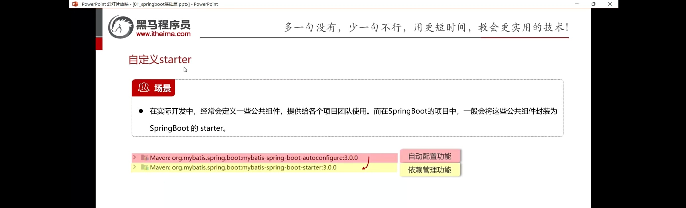
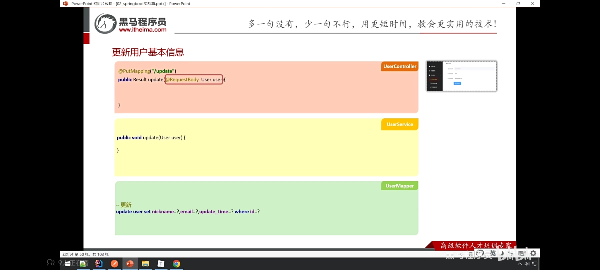
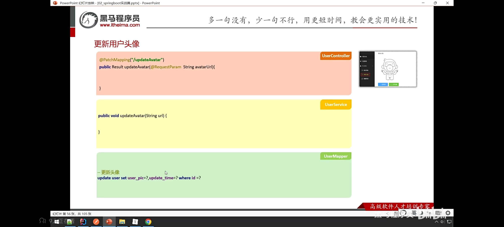

# 第二周周报

‍

Day 1

开会，确定本周学习内容，首次创建springboot项目


‍

Day 2

1.认识springboot在开发中的具体应用。

2.学习springboot工程创建与配置文件。

3.学习了yml配置信息书写和获取。

4.认识了一个项目的基本架构。

5.学习了springboot整合mybatis。

6.学习了Bean扫描。

7.学习了Bean注册。

8.学习并在idea中配置了maven,认识了maven的一些基础概念（仓库，坐标，项目构建，依赖引入）。

—————————————————————


**springboot第一个helloworld项目**

‍


**javaweb实现自己给自己发一个邮件**

```undefined
package com.itheima.springbootconfigfile.pojo;

import org.springframework.beans.factory.annotation.Value;
import org.springframework.boot.context.properties.ConfigurationProperties;
import org.springframework.stereotype.Component;

@Component
@ConfigurationProperties(prefix = "email")
public class EmailProperties {

    @Value("${email.user}")
    //发件人邮箱
    public String user ;

    @Value("${email.code}")
    //发件人邮箱授权码
    public String code ;

    @Value("${email.host}")
    //发件人邮箱对应的服务器域名,如果是163邮箱:smtp.163.com   qq邮箱: smtp.qq.com
    public String host ;

    @Value("${email.auth}")
    //身份验证开关
    private boolean auth ;

    public String getHost() {
        return host;
    }

    public void setHost(String host) {
        this.host = host;
    }

    public boolean isAuth() {
        return auth;
    }

    public void setAuth(boolean auth) {
        this.auth = auth;
    }

    public String getUser() {
        return user;
    }

    public void setUser(String user) {
        this.user = user;
    }

    public String getCode() {
        return code;
    }

    public void setCode(String code) {
        this.code = code;
    }

    @Override
    public String toString() {
        return "EmailProperties{" +
                "host='" + host + '\'' +
                ", auth=" + auth +
                ", user='" + user + '\'' +
                ", code='" + code + '\'' +
                '}';
    }
}

```


```undefined
package com.itheima.springbootconfigfile.controller;

import com.itheima.springbootconfigfile.pojo.EmailProperties;
import com.itheima.springbootconfigfile.service.EmailService;
import com.itheima.springbootconfigfile.utils.MailUtil;
import org.springframework.beans.factory.annotation.Autowired;
import org.springframework.web.bind.annotation.RequestMapping;
import org.springframework.web.bind.annotation.RestController;

@RestController
public class EmailController {
    //注入email配置信息实体类
    @Autowired
    private EmailService emailService;

    //测试方法
    @RequestMapping("/send")
    public Boolean send(){
        //收件人信箱
        String to = "3418451176@qq.com";
        //邮件标题
        String title = "测试邮件";
        //邮件正文
        String content  = "我是软件241的......";
        //发送邮件
        boolean flag = emailService.send(to,title,content);
        return flag;
    }

}

```


```undefined
#发件人相关的信息
email:
  user: 3418451176@qq.com
  code: kbmillurcolhdaji
  host: smtp.qq.com
  auth: true


#学生的爱好
hobbies:
  - play games
  - 打游戏
  - 打游戏
  - 打游戏

spring:
  mail:
    host: smtp.qq.com
    port: 465
    username: your_email@qq.com
    password: your_auth_code
    properties:
      mail:
        smtp:
          auth: true
          ssl:
            enable: true

```


```undefined
package com.itheima.springbootmybatis.pojo;

public class User {
  
    private Integer id;
    private String name;
    private Short age;
    private Short gender;
    private String phone;

    public User() {
    }

    public User(Integer id, String name, Short age, Short gender, String phone) {
        this.id = id;
        this.name = name;
        this.age = age;
        this.gender = gender;
        this.phone = phone;
    }

    public Integer getId() {
        return id;
    }

    public void setId(Integer id) {
        this.id = id;
    }

    public String getName() {
        return name;
    }

    public void setName(String name) {
        this.name = name;
    }

    public Short getAge() {
        return age;
    }

    public void setAge(Short age) {
        this.age = age;
    }

    public Short getGender() {
        return gender;
    }

    public void setGender(Short gender) {
        this.gender = gender;
    }

    public String getPhone() {
        return phone;
    }

    public void setPhone(String phone) {
        this.phone = phone;
    }

    @Override
    public String toString() {
        return "User{" +
                "id=" + id +
                ", name='" + name + '\'' +
                ", age=" + age +
                ", gender=" + gender +
                ", phone='" + phone + '\'' +
                '}';
    }
}

```


```undefined
package com.itheima.controller;

import com.itheima.springbootmybatis.pojo.User;
import com.itheima.springbootmybatis.service.UserService;
import org.springframework.beans.factory.annotation.Autowired;
import org.springframework.web.bind.annotation.RequestMapping;
import org.springframework.web.bind.annotation.RestController;

@RestController
public class UserController {

    @Autowired
    private UserService userService;


    @RequestMapping("/findById")
    public User findById(Integer id){
      return   userService.findById(id);
    }

}

```

***<u>查询结果：</u>***


**springboot整合mybatis**。

‍


‍

‍

‍


```undefined
<dependency>
            <groupId>cn.itcast</groupId>
            <artifactId>common-pojo</artifactId>
            <version>1.0</version>
        </dependency>
```


mvn install:install-file -Dfile=C:\Users\lihe4\Downloads\02_Bean注册资料\02_Bean注册资料\common-pojo-1.0-SNAPSHOT.jar -DgroupId=cn.itcast -DartifactId=common-pojo -Dversion=1.0 -Dpackaging=jar

**maven环境配置，并成功导入依赖和本地仓库的jar包。**

‍

‍

Day 3

1.继续学习bean注册。

2.学习了注册条件。

3.学习了springboot的自动配置原理。

4.学习了自定义starter相关知识。

5.结束基础篇，开始学习实战篇的“big-event”项目，学习开发模式和环境搭建。

6.学习写注册接口和接口参数校检。

7.学习了登录主逻辑和登录认证。

8.学习了JWT令牌。

9.学习postman的使用。

10.简单了解了SSM框架。

‍

**启动类（下图）**


**控制台正常输出，说明bean对象注入成功。**

```undefined
package com.itheima.config;

import org.springframework.context.annotation.ImportSelector;
import org.springframework.core.type.AnnotationMetadata;

import java.io.BufferedReader;
import java.io.IOException;
import java.io.InputStream;
import java.io.InputStreamReader;
import java.util.ArrayList;
import java.util.List;

public class CommonImportSelector implements ImportSelector {
    @Override
    public String[] selectImports(AnnotationMetadata importingClassMetadata) {
        //读取配置文件的内容
        List<String> imports = new ArrayList<>();
        InputStream is = CommonImportSelector.class.getClassLoader().getResourceAsStream("common.imports");
        BufferedReader br = new BufferedReader(new InputStreamReader(is));
        String line = null;
        try {
            while((line = br.readLine())!=null){
                imports.add(line);
            }

        } catch (IOException e) {
            throw new RuntimeException(e);
        } finally {
            if (br!=null){
                try {
                    br.close();
                } catch (IOException e) {
                    throw new RuntimeException(e);
                }
            }
        }
        return imports.toArray(new String[0]);
    }
}

```

​`ImportSelector`​ 实现动态配置类加载


‍

	**查询了解相关知识**

```undefined
 //如果配置文件中配置了指定的信息,则注入,否则不注入
    @ConditionalOnProperty(prefix = "country",name = {"name","system"})
//如果ioc容器中不存在Country,则注入Province,否则不注入
    @Bean
    @ConditionalOnMissingBean(Country.class)
    //如果当前环境中存在DispatcherServlet类,则注入Province,否则不注入
    //如果当前引入了web起步依赖,则环境中有DispatcherServlet,否则没有
    @ConditionalOnClass(name = "org.springframework.web.servlet.DispatcherServlet")
```

 **@ConditionalOnProperty，@ConditionalOnMissingBean，@ConditionalOnClass注解限定注册条件**


		

```undefined
package com.itheima.config;

import org.apache.ibatis.annotations.Mapper;
import org.mybatis.spring.SqlSessionFactoryBean;
import org.mybatis.spring.mapper.MapperScannerConfigurer;
import org.springframework.beans.factory.BeanFactory;
import org.springframework.boot.autoconfigure.AutoConfiguration;
import org.springframework.boot.autoconfigure.AutoConfigurationPackages;
import org.springframework.context.annotation.Bean;

import javax.sql.DataSource;
import java.util.List;

@AutoConfiguration//表示当前类是一个自动配置类
public class MyBatisAutoConfig {

    //SqlSessionFactoryBean
    @Bean
    public SqlSessionFactoryBean sqlSessionFactoryBean(DataSource dataSource){
        SqlSessionFactoryBean sqlSessionFactoryBean = new SqlSessionFactoryBean();
        sqlSessionFactoryBean.setDataSource(dataSource);
        return sqlSessionFactoryBean;
    }

    //MapperScannerConfigure
    @Bean
    public MapperScannerConfigurer mapperScannerConfigurer(BeanFactory beanFactory){
        MapperScannerConfigurer mapperScannerConfigurer = new MapperScannerConfigurer();
        //扫描的包:启动类所在的包及其子包
        List<String> packages = AutoConfigurationPackages.get(beanFactory);
        String p = packages.get(0);
        mapperScannerConfigurer.setBasePackage(p);

        //扫描的注解
        mapperScannerConfigurer.setAnnotationClass(Mapper.class);
        return mapperScannerConfigurer;
    }


}

```

			**springboot自动配置原理**



**了解自定义starter**


### **1.**  **​`anno`​**​

* **功能**: 存放自定义注解。
* **用途**:

  * 定义特定的元信息，帮助项目实现自定义逻辑，例如权限控制、日志记录、数据校验等。
  * 这些注解可能与切面编程（AOP）或框架功能结合使用。

---

### **2.**  **​`config`​**​

* **功能**: 项目配置文件存放处。
* **用途**:

  * 配置 Spring Boot 的核心功能，例如 `@Configuration`​ 类。
  * 数据源、MyBatis、Redis 或其他第三方组件的配置。
  * 配置跨域（CORS）、拦截器、过滤器等。

---

### **3.**  **​`controller`​**​

* **功能**: 控制层，用于处理前端请求。
* **用途**:

  * 定义 REST API 的入口，使用 `@RestController`​ 或 `@Controller`​ 注解。
  * 接收并处理客户端的 HTTP 请求（如 GET、POST、PUT、DELETE），调用服务层处理业务逻辑，并返回响应结果。

---

### **4.**  **​`exception`​**​

* **功能**: 处理异常相关的功能。
* **用途**:

  * 定义自定义异常类。
  * 集中式异常处理器，使用 `@ControllerAdvice`​ 和 `@ExceptionHandler`​ 注解。
  * 将异常转化为用户友好的错误消息。

---

### **5.**  **​`interceptors`​**​

* **功能**: 定义拦截器逻辑。
* **用途**:

  * 实现请求的预处理和后处理。
  * 例如：登录状态校验、权限认证、日志记录等。
  * 通常使用 Spring 的 `HandlerInterceptor`​ 接口实现。

---

### **6.**  **​`mapper`​**​

* **功能**: 数据访问层，用于操作数据库。
* **用途**:

  * 存放 MyBatis 的 Mapper 接口，使用 `@Mapper`​ 注解。
  * 定义数据库操作方法（如增删改查），这些方法会映射到对应的 SQL。
  * 与 `mapper`​ 文件夹通常会对应 XML 映射文件。

---

### **7.**  **​`pojo`​**​

* **功能**: 存放实体类。
* **用途**:

  * 定义与数据库表结构对应的 Java 对象。
  * 每个实体类通常包含字段、getter、setter 方法，有时还包含 `toString`​ 和 `equals`​ 等方法。
  * 这些类通常与 MyBatis 的 Mapper 配合使用。

---

### **8.**  **​`service`​**​

* **功能**: 服务层，负责业务逻辑的处理。
* **用途**:

  * 包含业务逻辑，实现控制层和数据访问层之间的解耦。
  * 定义接口和实现类，接口使用 `@Service`​ 注解。
  * 处理复杂的业务规则、事务管理和调用数据访问层。

---

### **9.**  **​`utils`​**​

* **功能**: 存放工具类。
* **用途**:

  * 定义一些通用的、与业务无关的功能，例如字符串处理、日期格式化、加密解密等。
  * 提高代码复用率，减少冗余。

---

### **10.**  **​`validation`​**​

* **功能**: 定义验证逻辑。
* **用途**:

  * 存放参数验证规则，可能使用 Hibernate Validator 框架。
  * 自定义校验注解和校验器。
  * 实现数据合法性校验，保证请求参数符合预期。

---

### **11.**  **​`BigEventApplication`​**​

* **功能**: 主启动类。
* **用途**:

  * 使用 `@SpringBootApplication`​ 注解，标识项目的入口。
  * 启动整个 Spring Boot 应用。

‍


```undefined
package itheima.pojo;


import lombok.AllArgsConstructor;
import lombok.NoArgsConstructor;

//统一响应结果
@NoArgsConstructor
@AllArgsConstructor
public class Result<T> {
    private Integer code;//业务状态码  0-成功  1-失败
    private String message;//提示信息
    private T data;//响应数据

    //快速返回操作成功响应结果(带响应数据)
    public static <E> Result<E> success(E data) {
        return new Result<>(0, "操作成功", data);
    }

    //快速返回操作成功响应结果
    public static Result success() {
        return new Result(0, "操作成功", null);
    }

    public static Result error(String message) {
        return new Result(1, message, null);
    }
}

```

**接下来学习了登录和注册功能的实现**


‍

**测试成功**

```undefined
package itheima.exception;

import itheima.pojo.Result;
import org.springframework.util.StringUtils;
import org.springframework.web.bind.annotation.ExceptionHandler;
import org.springframework.web.bind.annotation.RestControllerAdvice;

@RestControllerAdvice
public class GlobalExceptionHandler {

    @ExceptionHandler(Exception.class)
    public Result handleException(Exception e){
        e.printStackTrace();
        return Result.error(StringUtils.hasLength(e.getMessage())? e.getMessage() : "操作失败");
    }
}

```

**异常处理**


**JWT令牌**

```undefined
@PostMapping("/login")
    public Result<String> login(@Pattern(regexp = "^\\S{5,16}$") String username,@Pattern(regexp = "^\\S{5,16}$") String password){
         User loginUser = userService.findByUserName(username);
         if(loginUser==null){
             return Result.error("用户名错了哦，你是盗号狗吗！");
         }

        if (Md5Util.getMD5String(password).equals(loginUser.getPassword())) {
            //登录成功
            Map<String, Object> claims = new HashMap<>();
            claims.put("id", loginUser.getId());
            claims.put("username", loginUser.getUsername());
            String token = JwtUtil.genToken(claims);
        
            return Result.success(token);
        }
            return Result.error("密码错误，你果然是盗号狗！");
```

**登录认证**


**拦截器**

‍

---

Day 4

1.学习了获取用户详细信息。

2.学习了ThreadLocal优化。

‍


---

Day 5

1.学习了更新用户基本信息及其参数校检。

2.学习了更新用户头像。

3.学习了更新用户密码。

4.学习了新增文章分类。

5.学习了文章分类列表，获取文章分类详情。

6.学习了更新文章分类。

‍

‍




##### 更新基本信息成功


‍

#### 参数校验



‍

​​


##### 对文章分类模块的一些增删改查


```cppbool
package itheima.controller;

import itheima.pojo.Category;
import itheima.pojo.Result;
import itheima.service.CategoryService;
import org.springframework.beans.factory.annotation.Autowired;
import org.springframework.validation.annotation.Validated;
import org.springframework.web.bind.annotation.*;

import java.util.List;

@RestController
@RequestMapping("/category")
public class CategoryController {
    @Autowired
    private CategoryService categoryService;

    @PostMapping
    public Result add(@RequestBody @Validated(Category.Add.class) Category category){
        categoryService.add(category);
        return Result.success();
    }

    @GetMapping
    public Result<List<Category>> list(){
        List<Category> cs = categoryService.list();
        return Result.success(cs);
    }

    @GetMapping("/detail")
    public Result<Category> detail(Integer id){
        Category c = categoryService.findById(id);
        return Result.success(c);
    }

    @PutMapping
    public Result update(@RequestBody @Validated(Category.Update.class) Category category){
        categoryService.update(category);
        return Result.success();
    }

    @DeleteMapping
    public Result delete(Integer id){
        categoryService.deleteById(id);
        return Result.success();
    }
}

```

#### Controller层

```cppbool
package itheima.service;

import itheima.pojo.Category;

import java.util.List;

public interface CategoryService {
    //新增分类
    void add(Category category);

    //列表查询
    List<Category> list();

    //根据id查询分类信息
    Category findById(Integer id);

    //更新分类
    void update(Category category);

    //删除分类
    void deleteById(Integer id);
}

```

```cppbool
package itheima.service.impl;

import itheima.mapper.CategoryMapper;
import itheima.pojo.Category;
import itheima.service.CategoryService;
import itheima.utils.ThreadLocalUtil;
import org.springframework.beans.factory.annotation.Autowired;
import org.springframework.stereotype.Service;

import java.time.LocalDateTime;
import java.util.List;
import java.util.Map;

@Service
public class CategoryServiceImpl implements CategoryService {

    @Autowired
    private CategoryMapper categoryMapper;

    @Override
    public void add(Category category) {
        //补充属性值
        category.setCreateTime(LocalDateTime.now());
        category.setUpdateTime(LocalDateTime.now());

        Map<String,Object> map = ThreadLocalUtil.get();
        Integer userId = (Integer) map.get("id");
        category.setCreateUser(userId);
        categoryMapper.add(category);
    }

    @Override
    public List<Category> list() {
        Map<String,Object> map = ThreadLocalUtil.get();
        Integer userId = (Integer) map.get("id");
        return categoryMapper.list(userId);
    }

    @Override
    public Category findById(Integer id) {
        Category c = categoryMapper.findById(id);
        return c;
    }

    @Override
    public void update(Category category) {
        category.setUpdateTime(LocalDateTime.now());
        categoryMapper.update(category);
    }

    @Override
    public void deleteById(Integer id) {
        categoryMapper.deleteById(id);
    }
}

```

#### Service层

```cppbool
package itheima.mapper;

import itheima.pojo.Category;
import org.apache.ibatis.annotations.*;

import java.util.List;

@Mapper
public interface CategoryMapper {
    //新增
    @Insert("insert into category(category_name,category_alias,create_user,create_time,update_time) " +
            "values(#{categoryName},#{categoryAlias},#{createUser},#{createTime},#{updateTime})")
    void add(Category category);

    //查询所有
    @Select("select * from category where create_user = #{userId}")
    List<Category> list(Integer userId);

    //根据id查询
    @Select("select * from category where id = #{id}")
    Category findById(Integer id);

    //更新
    @Update("update category set category_name=#{categoryName},category_alias=#{categoryAlias},update_time=#{updateTime} where id=#{id}")
    void update(Category category);

    //根据id删除
    @Delete("delete from category where id=#{id}")
    void deleteById(Integer id);
}

```

#### Mapper层

---

‍
